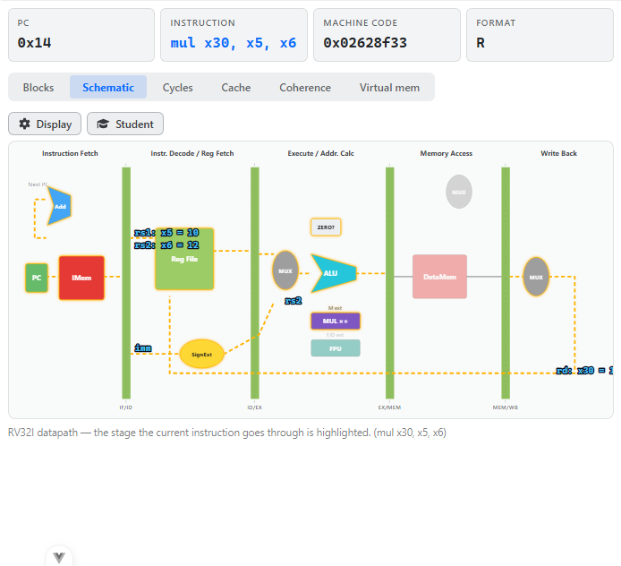
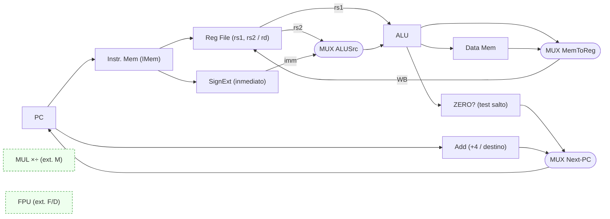
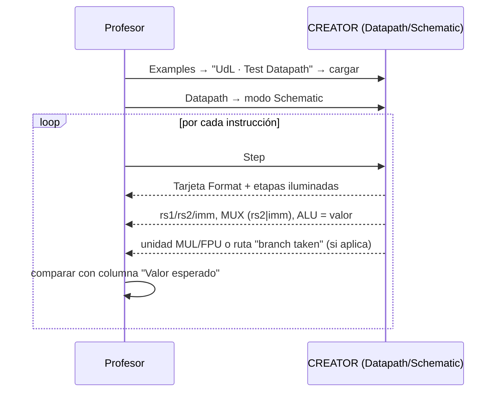

# Plan de pruebas manual — Vista DATAPATH (modo *Schematic*)



> *Captura de referencia del simulador real (este plan describe que debe verse y por que).*

> CREATOR · extensión UdL (proyecto PID RISC-V) · arquitectura **RISC-V (RV32IMFD)**
> Programa de prueba: `examples/udl-tests/datapath/datapath_completo.s` · grupo de ejemplos **"UdL · Test Datapath"**

## Objetivo y destinatario

Este documento permite a un **profesor de Arquitectura de Computadores de la UdL** validar que la
vista *Datapath → Schematic* de CREATOR es **coherente con la teoría del camino de datos
mono-ciclo (single-cycle) de RISC-V** tal como se presenta en Patterson & Hennessy (P&H COD-RISCV,
cap. 4).

Se valida, instrucción a instrucción, que:

1. Cada uno de los **seis formatos** RISC-V (R / I / S / B / U / J) se ejecuta sobre **el mismo
   camino de datos**, activando un **subconjunto** de etapas y recursos.
2. Las **cinco fases** universales (IF, ID, EX, MEM, WB) se **iluminan** sólo cuando la instrucción
   las usa.
3. Los **MUX** seleccionan correctamente el segundo operando de la ALU (registro vs. inmediato) y la
   fuente de escritura en *write-back* (ALU vs. memoria).
4. Las **unidades de extensión** (MUL de la extensión *M*, FPU de las extensiones *F/D*) se iluminan
   sólo para las instrucciones que les corresponden.
5. La **resolución del salto** (ruta *branch taken* y actualización del PC) es correcta.

No es una prueba de rendimiento ni de pipeline temporal (eso corresponde al modo *Cycles*). Es una
**verificación funcional** del datapath y de su correspondencia con la teoría.

---

## Teoría aplicada — qué modela esta vista

> **El datapath mono-ciclo de RISC-V.** Una CPU RISC ejecuta cada instrucción recorriendo, como
> máximo, cinco fases funcionales: **Instruction Fetch (IF)**, **Instruction Decode / Register
> Fetch (ID)**, **Execute / Address calculation (EX)**, **Memory access (MEM)** y **Write-Back
> (WB)**. Un único conjunto de recursos físicos —PC, memoria de instrucciones, banco de registros,
> generador de inmediato, ALU, memoria de datos y multiplexores— sirve para **todas** las
> instrucciones; lo que cambia entre formatos es **qué señales de control se activan** y, por tanto,
> **qué recursos se usan**.
> *Fuente: P&H COD-RISCV, cap. 4, §4.1–§4.4 (especialmente Fig. 4.17 — el datapath completo con la
> unidad de control).*

> **Por qué un mismo datapath sirve para seis formatos.** La ISA RISC-V codifica las instrucciones
> en formatos de **longitud fija (32 bits)** con los campos de registro (`rs1`, `rs2`, `rd`) y de
> función (`opcode`, `funct3`, `funct7`) **en posiciones fijas**. Esto permite leer el banco de
> registros y empezar a generar el inmediato **antes** de terminar de decodificar, y que la ruta
> física sea común. La diferencia entre formatos está en **qué campos existen** y **cómo se forma el
> inmediato**.
> *Fuente: especificación RISC-V *Unprivileged ISA*, formatos R/I/S/B/U/J; P&H COD-RISCV §2.5 y
> §4.4.*

### Tabla formato → campos y recursos activados

| Formato | Campos presentes        | Inmediato | Etapas activas (típicas) | MUX ALU (ALUSrc) | MUX WB (MemToReg) | Ejemplo del programa |
|---------|-------------------------|-----------|--------------------------|------------------|-------------------|----------------------|
| **R**   | rd, rs1, rs2            | —         | IF · ID · EX · WB        | rs2 (=0)         | ALU (=0)          | `add t2,t0,t1`       |
| **I**   | rd, rs1, imm[11:0]      | 12 b sign-ext | IF · ID · EX · WB    | imm (=1)         | ALU (=0)          | `addi t0,x0,10`      |
| **I-mem** (load) | rd, rs1, imm[11:0] | 12 b   | IF · ID · EX · **MEM** · WB | imm (=1)     | **MEM (=1)**      | `lw a2,0(a1)`        |
| **S**   | rs1, rs2, imm[11:0]     | 12 b (split) | IF · ID · EX · **MEM** | imm (=1)        | — (no WB)         | `sw t2,4(a1)`        |
| **B**   | rs1, rs2, imm[12:1]     | 13 b (split) | IF · ID · EX (sin WB) | rs2 (=0)        | — (no WB)         | `beq t0,t0,taken`    |
| **U**   | rd, imm[31:12]          | 20 b alto | IF · ID · EX · WB        | imm (=1)         | ALU (=0)          | `lui s0,0x12345`     |
| **J**   | rd, imm[20:1]           | 21 b (split) | IF · ID · WB (link)   | —                | —                 | `j skip`             |

> **Nota sobre U-type (`lui`): no usa `rs1`.** El formato U sólo tiene `rd` y un inmediato de 20 bits
> que se coloca en los bits [31:12] del resultado. No hay registro fuente: `lui s0, 0x12345` produce
> directamente `0x12345000` (0x12345 << 12). Por eso en el esquema **no debe iluminarse la lectura de
> `rs1`** para esta instrucción.
> *Fuente: especificación RISC-V, formato U; P&H COD-RISCV §2.5.*

> **Por qué loads/stores usan la etapa MEM.** Son las **únicas** instrucciones que acceden a la
> memoria de datos. La ALU calcula la **dirección efectiva** (`rs1 + imm`) en EX; en MEM, el *load*
> lee (`MemRead`) y el *store* escribe (`MemWrite`). El *store* **no** escribe en registro (no hay
> WB); el *load* sí, y su MUX de WB elige el dato de memoria (`MemToReg = 1`).
> *Fuente: P&H COD-RISCV §4.4, Fig. 4.10 / 4.17.*

> **Extensiones M y F/D.** El multiplicador entero (`mul`, `div`, `rem`…) pertenece a la extensión
> **M**; la unidad de coma flotante (`fadd.d`, `fld`…) a las extensiones **F** (simple) y **D**
> (doble). En un RV32I "puro" estas unidades **no existen**. CREATOR las dibuja sólo si la
> arquitectura cargada incluye la extensión, y las ilumina según la instrucción.
> *Fuente: especificación RISC-V, extensiones M y F/D; P&H COD-RISCV cap. 3 (aritmética).*

### Diagrama del concepto (datapath mono-ciclo RISC-V)



> Correspondencia con la UI: las cabeceras de columna del SVG son **Instruction Fetch ·
> Instr. Decode/Reg Fetch · Execute/Addr. Calc · Memory Access · Write Back**, y los bloques se
> etiquetan **PC, IMem, Add, Reg File, SignExt, MUX, ALU, ZERO?, DataMem, MUX, MUX** (los registros
> de etapa IF/ID … MEM/WB aparecen como separadores; en esta vista funcional sólo delimitan fases).

---

## Preparación

| Elemento | Valor |
|----------|-------|
| Arrancar | En `CREATOR/GCDA-UDL-creator` ejecutar `npx vite` y abrir `http://localhost:5210` |
| Arquitectura | **RISC-V (RV32IMFD)** (selector de arquitectura) |
| Cargar ejemplo | Botón **Examples** → en el desplegable de CONJUNTOS elegir **"UdL · Test Datapath"** → clicar **"Datapath · todos los formatos"** |
| Vista | Pestaña **Datapath** → botón de modo **Schematic** (segundo de los 6: *Blocks · Schematic · Cycles · Cache · Coherence · Virtual mem.*) |
| Ejecución | **Step** (paso a paso, una instrucción) — imprescindible para esta prueba; **Run** ejecuta todo de golpe |

**Configuración por defecto relevante de la vista (panel de engranaje "Display"):**

- Esquema de color: **Classic (Patterson)**. Color de valor por defecto **azul** (`#4fc3f7`), realce
  de la etapa activa en **ámbar** (`#ffb300`).
- Casillas **Values** y **Wires** activadas: muestran los valores de operandos y animan los hilos de
  la etapa activa.
- **Student** (modo estudiante, segundo botón): activa los signos **`?`** sobre cada bloque; al
  pulsarlos aparece una explicación (qué hace, de dónde vienen los datos, qué observar). Útil para
  contrastar la explicación de la herramienta con la teoría.

> **Qué se ve tras cada Step.** Arriba aparecen cuatro tarjetas de resumen: **PC**, **Instruction**
> (texto ensamblador), **Machine code** (hex) y **Format** (R/I/S/B/U/J/SYS). En el SVG se iluminan
> las etapas activas, se muestran los valores `rs1/rs2/rd/imm`, el resultado de la ALU (`= valor`),
> la selección del MUX de la ALU (`imm` o `rs2`) y, si procede, la ruta *branch taken* y las unidades
> MUL/FPU.

---

## El programa de prueba

`datapath/datapath_completo.s` ejecuta **una instrucción de cada formato**, más una de la extensión **M** y otra de la
**FPU**, de modo que con *Step* se recorre todo el espacio de comportamiento del datapath. Está
diseñado para que cada paso active un subconjunto **distinto** de recursos, y para que los valores
sean fáciles de comprobar mentalmente (constantes pequeñas).

```asm
.data
    arr:  .word 7, 11          # vector para load/store
    da:   .double 3.5          # operandos FPU
    db:   .double 1.5
.text
main:
    addi t0, x0, 10            # [I]  t0 = 10
    addi t1, x0, 12            # [I]  t1 = 12
    add  t2, t0, t1            # [R]  t2 = 22   (MUX ALU usa rs2, no inmediato)
    sub  t3, t1, t0            # [R]  t3 = 2
    and  t4, t0, t1            # [R/logic] 1010 & 1100 = 1000 -> t4 = 8
    mul  t5, t0, t1            # [M]  ilumina MUL -> t5 = 120
    lui  s0, 0x12345           # [U]  s0 = 0x12345000  (sin rs1)
    la   a1, arr               # pseudo (auipc+addi) -> dirección base de arr
    lw   a2, 0(a1)             # [I-mem/LOAD]  etapa MEM -> a2 = 7
    sw   t2, 4(a1)             # [S/STORE]     etapa MEM escribe -> arr[1] = 22
    beq  t0, t0, taken         # [B]  t0==t0 -> salto TOMADO
    addi a3, x0, 999           # (saltada)
taken:
    bne  t0, t1, no_taken      # [B]  t0!=t1 -> tomado
    j    skip                  # [J]  salto incondicional
no_taken:
    addi a3, x0, 1
skip:
    la   a4, da
    fld  f0, 0(a4)             # carga 3.5 en f0
    la   a4, db
    fld  f2, 0(a4)             # carga 1.5 en f2
    fadd.d f4, f0, f2          # [FPU] ilumina FPU -> f4 = 5.0
    li   a7, 10
    ecall                      # exit
```

> **Aviso de coherencia.** El comentario del archivo fuente junto a `sw t2,4(a1)` dice "arr[1] = 42";
> es un **typo del comentario**. El valor correcto es `t2 = 22`, luego tras el *store* `arr[1] = 22`
> (verificar en la herramienta: tras el `sw`, `arr[1]` debe valer 22, no 42).

---

## Pasos de validación

Las direcciones de PC se muestran "(verificar en la herramienta)" porque dependen de la base de
`.text` del simulador; el **incremento** entre instrucciones secuenciales debe ser **+4** (RV32, paso
fijo de palabra). Los valores numéricos de registro **sí** son deterministas y se dan calculados.

| Paso | Acción (Step sobre…) | Dónde mirar (modo Schematic) | Valor esperado | Justificación teórica |
|------|----------------------|------------------------------|----------------|-----------------------|
| 1 | `addi t0,x0,10` | Tarjeta **Format** = `I`; etapas **IF·ID·EX·WB** iluminadas (sin MEM); MUX ALU muestra `imm`; valor `imm: 10`; resultado `t0 = 10` | `t0 = 10`; ALUSrc=1, MemToReg=0 | Formato **I**: 2º operando de la ALU es el inmediato (ALUSrc=1); no accede a memoria. *P&H §4.4.* |
| 2 | `addi t1,x0,12` | Igual que el paso 1 con `imm: 12` | `t1 = 12` | Idem formato I. |
| 3 | `add t2,t0,t1` | **Format** = `R`; etapas **IF·ID·EX·WB**; el MUX de la ALU muestra **`rs2`** (no `imm`); `rs1: t0 = 10`, `rs2: t1 = 12`; resultado `= 22` | `t2 = 22`; ALUSrc=0 | Formato **R**: la ALU toma **rs2**, no el inmediato (ALUSrc=0). Es el contraste clave con I. *P&H §4.4.* |
| 4 | `sub t3,t1,t0` | **Format** = `R`; `rs1: t1 = 12`, `rs2: t0 = 10`; ALU `= 2` | `t3 = 2` | Resta R-type: 12 − 10 = 2. |
| 5 | `and t4,t0,t1` | **Format** = `R` (categoría *Logic*); ALU `= 8` | `t4 = 8` | `1010 & 1100 = 1000₂ = 8`. La ALU realiza la operación lógica en EX. *P&H §4.4 / App. A.* |
| 6 | `mul t5,t0,t1` | **Format** = `R`; se **ilumina la unidad MUL ×÷** (etiqueta "M ext"); etapa EX activa | `t5 = 120`; unidad = `mul` | `mul` pertenece a la **extensión M**: usa el multiplicador, no la ALU básica. Sólo visible porque RV32**IM**FD incluye M. *Espec. RISC-V ext. M.* |
| 7 | `lui s0,0x12345` | **Format** = `U`; etapas IF·ID·EX·WB; **NO** debe verse lectura de `rs1`; resultado en `rd` | `s0 = 0x12345000` | Formato **U**: `imm << 12`, sin registro fuente. `0x12345 << 12 = 0x12345000`. *Espec. RISC-V formato U.* |
| 8 | `la a1,arr` | Pseudoinstrucción → **dos** Step (auipc + addi); **Format** = `U` y luego `I` | `a1` = dirección base de `arr` (verificar en la herramienta) | `la` se expande a `auipc`+`addi`: parte alta (U) + parte baja (I). *P&H §2.12 (pseudo).* |
| 9 | `lw a2,0(a1)` | **Format** = `I` (load); se ilumina **además la etapa MEM (DataMem)**; MUX de WB toma el dato de memoria | `a2 = 7` (= `arr[0]`); MemRead=1, MemToReg=1 | Load: ALU calcula dirección en EX, **DataMem** se lee en MEM, y el dato (no la ALU) va a WB. *P&H §4.4.* |
| 10 | `sw t2,4(a1)` | **Format** = `S`; etapas IF·ID·EX·**MEM**; **sin WB**; DataMem en modo escritura | `arr[1] = 22`; MemWrite=1, RegWrite=0 | Store: escribe memoria en MEM y **no** escribe registro. *P&H §4.4.* |
| 11 | `beq t0,t0,taken` | **Format** = `B`; aparece la ruta animada **"branch taken"**; el MUX de Next-PC selecciona el destino; PC ← destino | Salto **TOMADO** (`t0==t0`); Branch=1, RegWrite=0 | Branch B-type: el test (`ZERO?`) decide; al cumplirse, el PC se carga con el destino, no con PC+4. *P&H §4.4.* |
| 12 | `bne t0,t1,no_taken` | **Format** = `B`; ruta **"branch taken"** visible | Salto **TOMADO** (`t0=10 ≠ t1=12`) | `bne` se toma cuando los operandos difieren. |
| 13 | `j skip` | **Format** = `J`; salto incondicional; MUX Next-PC al destino | Salto **TOMADO** siempre | J-type: salto incondicional; el PC salta al destino. *P&H §4.4.* |
| 14 | `fld f0,0(a4)` | Carga FP desde memoria a `f0`; etapa MEM activa | `f0 = 3.5` | Carga de doble precisión (ext. D) desde `da`. |
| 15 | `fld f2,0(a4)` | Igual, a `f2` | `f2 = 1.5` | Carga desde `db`. |
| 16 | `fadd.d f4,f0,f2` | **Format** = `R` (aritmética FP); se **ilumina la unidad FPU** (etiqueta "F/D ext"); EX activa | `f4 = 5.0`; unidad = `fpu` | Suma en coma flotante doble: `3.5 + 1.5 = 5.0`. Usa la **FPU**, no la ALU. Sólo visible porque RV32IM**FD** incluye F/D. *Espec. RISC-V ext. F/D.* |

### Flujo de comprobación (resumen visual)



---

## Variaciones

Cambios que el profesor debe probar para confirmar que la herramienta reacciona **según la teoría**:

| # | Cambio | Qué debe cambiar en la vista | Por qué (teoría) |
|---|--------|------------------------------|------------------|
| V1 | Cargar el ejemplo bajo **RISC-V (RV32I)** "puro" (sin M/F/D), si está disponible, o una ISA equivalente sin extensiones | Las unidades **MUL** y **FPU** **desaparecen** del esquema; `mul`/`fadd.d` darían error de ensamblado o instrucción ilegal | En RV32I no existen multiplicador ni FPU; la herramienta dibuja esas unidades **sólo** si la extensión está presente. *Espec. RISC-V; P&H cap. 3.* |
| V2 | Contrastar paso 1 (`addi`, I) con paso 3 (`add`, R) mirando el rótulo del **MUX de la ALU** | I → `imm`; R → `rs2` | El bit de control **ALUSrc** distingue ambos formatos. *P&H §4.4, Fig. 4.17.* |
| V3 | Modificar `beq t0,t0` por `beq t0,t1` (recompilar) | El salto pasa a **NO tomado**; **no** debe aparecer "branch taken"; PC ← PC+4 | El resultado del test `ZERO?` cambia la entrada del MUX de Next-PC. *P&H §4.4.* |
| V4 | En el panel **Display**, activar **Print (B/W)** o **High contrast** | Cambian colores/halo pero **no** el comportamiento ni los valores | La apariencia es independiente de la semántica; los valores deben permanecer idénticos. |
| V5 | Activar **Student** y pulsar el `?` de `muxex`, `signext`, `datamem`, `mul`, `fpu` | Aparecen explicaciones por bloque | Permite contrastar la descripción de la herramienta con la del libro (ALUSrc, sign-extend, MemRead/Write, ext. M, ext. F/D). |
| V6 | Cambiar a modo **Blocks** y repetir un Step | Se ven las mismas fases como cadena `IF→ID→EX→MEM→WB` y los **Control signals** (RegWrite, ALUSrc, MemRead, MemWrite, Branch, MemToReg) y las **Micro-operations (RTL)** | Comprobar que las señales de control por formato coinciden con la tabla teórica (R: RegWrite=1,ALUSrc=0; I: ALUSrc=1; S: MemWrite=1,RegWrite=0; B: Branch=1; etc.). *`signalMap` ≙ P&H Fig. 4.18.* |

---

## Checklist de validación

Marque cada casilla si lo observado **coincide con la teoría**; anote discrepancias.

| ✔ | Comprobación | ¿Coincide con teoría? (Sí/No) | Notas |
|---|--------------|-------------------------------|-------|
| - [ ] | Tras cargar, la arquitectura es RV32IMFD y el ejemplo "Datapath · todos los formatos" aparece | | |
| - [ ] | El PC se incrementa en **+4** entre instrucciones secuenciales | | |
| - [ ] | `addi` (paso 1) marca **Format = I**, ilumina IF·ID·EX·WB (sin MEM) y MUX = `imm` | | |
| - [ ] | `add` (paso 3) marca **Format = R**, MUX de la ALU = `rs2`, resultado `= 22` | | |
| - [ ] | `sub` da `t3 = 2` y `and` da `t4 = 8` (1010 & 1100) | | |
| - [ ] | `mul` ilumina la **unidad MUL ×÷** y `t5 = 120` | | |
| - [ ] | `lui s0,0x12345` da `s0 = 0x12345000` y **no** usa `rs1` (U-type) | | |
| - [ ] | `lw a2,0(a1)` ilumina la etapa **MEM (DataMem)** y `a2 = 7` | | |
| - [ ] | `sw t2,4(a1)` activa MEM en escritura, **sin WB**, y deja `arr[1] = 22` | | |
| - [ ] | `beq t0,t0` muestra la ruta **"branch taken"** y el PC salta al destino | | |
| - [ ] | `bne t0,t1` también se toma; `j skip` salta incondicionalmente | | |
| - [ ] | `fadd.d f4,f0,f2` ilumina la **unidad FPU** y `f4 = 5.0` | | |
| - [ ] | (V1) Bajo una ISA sin M/F/D, las unidades MUL y FPU **no** aparecen | | |
| - [ ] | (V3) Con `beq` no tomado, **no** aparece "branch taken" y PC ← PC+4 | | |
| - [ ] | (V6) En modo Blocks, las señales de control por formato coinciden con la tabla teórica | | |

---

## Referencias

1. **D. A. Patterson, J. L. Hennessy.** *Computer Organization and Design: The Hardware/Software
   Interface, RISC-V Edition.* Morgan Kaufmann. — **Cap. 4** (camino de datos mono-ciclo y control,
   §4.1–§4.4, Fig. 4.17–4.18); §2.5 (formatos de instrucción); §2.12 (pseudoinstrucciones);
   cap. 3 (aritmética entera y en coma flotante).
2. **A. Waterman, K. Asanović (eds.).** *The RISC-V Instruction Set Manual, Volume I: Unprivileged
   ISA.* RISC-V International. — Formatos R/I/S/B/U/J; extensiones **M** (multiplicación/división) y
   **F/D** (coma flotante simple/doble).
3. **J. L. Hennessy, D. A. Patterson.** *Computer Architecture: A Quantitative Approach.* Morgan
   Kaufmann. — Apéndice de fundamentos de la organización de la ruta de datos y la ISA.
4. **W. Stallings.** *Computer Organization and Architecture.* Pearson. — Ciclo de instrucción y
   unidad de control (referencia complementaria).

---

> **Financiación.** This work has been granted by the Ministerio de Ciencia, Innovación y
> Universidades (MICIU) AEI/10.13039/501100011033 under contract PID2023-146193OB-I00.
