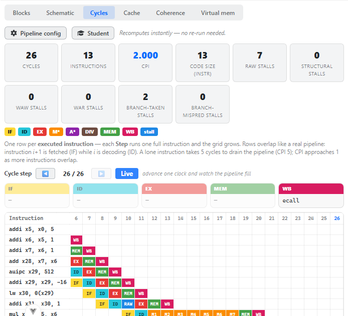
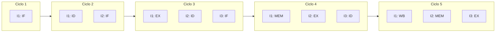
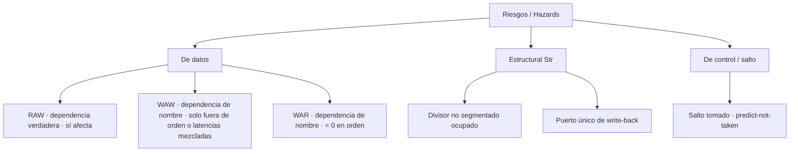

# Plan de validación manual — Módulo PIPELINE / CICLOS (modo "Cycles")



> *Captura de referencia del simulador real (este plan describe que debe verse y por que).*

Vista **Datapath → Cycles** de CREATOR (extensión UdL, estilo WinMIPS64).
Programa de prueba: `examples/udl-tests/pipeline/pipeline_completo.s`.

---

## Objetivo y destinatario

Este documento permite a un **profesor de Arquitectura de Computadores de la UdL** validar que la
vista de ciclos/pipeline implementada en CREATOR es **coherente con la teoría de segmentación**
(P&H COD-RISCV cap. 4; H&P CAQA apéndice C). Concretamente, se valida que el simulador:

1. dibuja el **solapamiento de etapas** IF/ID/EX/MEM/WB en una rejilla instrucción × ciclo;
2. detecta y clasifica los **riesgos** (hazards): de datos (RAW/WAW/WAR), estructurales (Str) y de
   control (saltos);
3. modela el **cortocircuito (forwarding)** y la **burbuja inevitable del load-use**;
4. modela las **unidades multiciclo** (multiplicador M1..M7, sumador FP A1..A4, divisor DIV no
   segmentado) y sus stalls estructurales;
5. calcula correctamente **CPI = ciclos / instrucciones** y los contadores de stalls;
6. **recalcula al instante** al cambiar la configuración (forwarding/latencias), sin re-ejecutar.

> **Naturaleza del modelo (importante para interpretar la validación).** CREATOR **no tiene un
> pipeline real**: su motor ejecuta instrucción a instrucción de forma *funcional*. La rejilla de
> ciclos la produce un **planificador puro post-hoc** (`src/core/trace/pipelineModel.mts`,
> función `schedulePipeline`) que recibe la **secuencia de instrucciones realmente ejecutadas** y
> una configuración de pipeline, y sintetiza el calendario ciclo a ciclo. Por eso, cambiar
> forwarding o las latencias **recalcula la rejilla instantáneamente** sin volver a correr el
> programa. La validación comprueba que ese planificador respeta la teoría, **no** que exista
> hardware segmentado.

---

## Teoría aplicada — qué modela esta vista, de dónde viene, por qué es así

### Segmentación (pipelining) y solapamiento

> **Pipelining.** Una instrucción se divide en *etapas* y varias instrucciones se ejecutan
> solapadas, una por etapa y por ciclo. El RISC-V clásico de P&H usa 5 etapas:
> **IF** (instruction fetch), **ID** (decode / lectura de registros), **EX** (ejecución / ALU),
> **MEM** (acceso a memoria) y **WB** (write-back / escritura en registros).
> *Fuente: P&H COD-RISCV, §4.5 ("An Overview of Pipelining").*

En régimen permanente el pipeline emite una instrucción por ciclo, de modo que el **CPI tiende a
1** aunque la *latencia* de cada instrucción siga siendo de 5 ciclos. Una instrucción aislada
necesita 5 ciclos para "vaciar" el cañón (CPI = 5).



### Los tres tipos de riesgos (hazards)

> **Riesgos** son situaciones que impiden que la siguiente instrucción entre en su etapa en el
> ciclo previsto. Se clasifican en tres familias:
> - **Estructural:** dos instrucciones necesitan el mismo recurso hardware a la vez (p. ej. un
>   único divisor no segmentado, o un único puerto de WB).
> - **De datos:** una instrucción necesita el resultado de otra que aún no está disponible.
> - **De control:** un salto cambia el flujo y el pipeline ya ha buscado (IF) instrucciones que
>   quizá no deba ejecutar.
> *Fuente: P&H COD-RISCV, §4.5 ("Hazards"); H&P CAQA, apéndice C.*

### Dependencias de datos: RAW, WAW, WAR

> - **RAW** (*Read After Write*, dependencia verdadera): el consumidor lee un registro que el
>   productor aún no ha escrito. **Es el único riesgo de datos real en un pipeline escalar en
>   orden.**
> - **WAW** (*Write After Write*) y **WAR** (*Write After Read*): son dependencias de *nombre*
>   (antidependencias). En un pipeline **escalar y con emisión en orden** de un solo flujo, las
>   escrituras llegan a WB en orden de programa, por lo que **WAR = 0** y **WAW** sólo puede
>   aparecer si una instrucción posterior y *más corta* (latencia menor) alcanzara WB antes que un
>   productor anterior aún en vuelo. WAW y WAR **sí** importan en ejecución **fuera de orden**.
> *Fuente: H&P CAQA, §3.1 (dependencias de datos y de nombre); P&H COD-RISCV §4.5.*



### Cortocircuito (forwarding) y la burbuja del load-use

> **Forwarding (bypassing).** En lugar de esperar a WB, el resultado se reenvía desde la salida de
> la etapa que lo produce hasta la entrada de EX de la instrucción que lo necesita. Para una
> cadena **ALU→ALU**, el resultado está listo al final de EX y se reenvía a la EX siguiente, por lo
> que **no hay burbuja**. Sin forwarding, el valor sólo está disponible tras WB → hasta 2-3
> burbujas RAW.
>
> **Load-use hazard.** El dato cargado por un `lw` no está disponible hasta el **final de MEM**.
> La instrucción inmediatamente posterior que lo usa necesita el dato en su EX, que cae un ciclo
> antes → **queda 1 burbuja inevitable aunque haya forwarding**. Esta es la diferencia esencial
> entre un productor ALU y un productor LOAD.
> *Fuente: P&H COD-RISCV, §4.7 ("Data Hazards: Forwarding versus Stalling") y §4.8 (control).*

En el modelo (`schedulePipeline`), un registro escrito queda disponible para un consumidor en:

| Caso | Forwarding ON | Forwarding OFF |
|------|---------------|----------------|
| Productor ALU/FU | fin de EX → `exEnd + 1` | tras WB → `wbCycle + 1` |
| Productor LOAD | tras MEM → `memCycle + 1` (≡ 1 burbuja) | tras WB → `wbCycle + 1` |

### Unidades multiciclo y stalls estructurales

> El multiplicador y el sumador FP son **segmentados** (pipelined): ocupan varias subetapas
> (M1..Mn, A1..An) pero admiten una nueva operación por ciclo. El **divisor no es segmentado**: una
> división retiene la unidad durante toda su latencia, de modo que una segunda división debe
> esperar (**stall estructural Str**). Además, todas las instrucciones comparten **un único puerto
> de write-back**; si dos quisieran escribir en el mismo ciclo, la más joven se retrasa (también
> Str). *Fuente: H&P CAQA, apéndice C (pipelines multiciclo de FP); WinMIPS64.*

Latencias por defecto del modelo: **FP add = 4 (A1..A4)**, **Mul = 7 (M1..M7)**, **Div = 24 (DIV)**.

> **Procedencia (verificada).** Estas unidades multi-ciclo y sus latencias (4/7/24) y el riesgo WAW
> **no** están en los libros *Computer Organization and Design* (P&H COD). La fuente **verificable** es
> **WinMIPS64** (diálogo *Set Architecture*: "FP Addition Latency 4 · FP Multiplier Latency 7 · FP
> Division Latency 24"; guía UC3M `practica1_winmips64.pdf`). Su origen último es H&P *Computer
> Architecture: A Quantitative Approach* (Appendix C), **no incluido** en las referencias del proyecto.
> Verificación completa figura/página/cita en `creator_riscv_udl_plan/17_verificacion_libros_datapath_pipeline.md`.

### Penalización de salto y predicción no-tomado

> El salto se **resuelve en EX** con predicción **"no tomado"** (*predict-not-taken*). Si el salto
> **se toma**, las instrucciones ya buscadas tras él son erróneas y deben descartarse →
> **penalización de control** (en el modelo, 2 ciclos contabilizados como *Branch-taken stalls*).
> Con **BTB** acertado el coste de un salto ya visto tomado es 0; con **delay slot** se oculta 1
> ciclo de penalización. *Fuente: P&H COD-RISCV, §4.8 ("Control Hazards"); Stallings (predicción).*

### CPI

> **CPI = ciclos totales / número de instrucciones.** En un pipeline ideal sin riesgos CPI → 1.
> Cada burbuja (RAW, Str, salto) añade ciclos sin añadir instrucciones, por lo que **CPI > 1**.
> *Fuente: P&H COD-RISCV, §1.6 y §4.5.*

---

## Preparación

| Elemento | Valor |
|----------|-------|
| Arrancar | En `CREATOR/GCDA-UDL-creator`: `npx vite` → abrir `http://localhost:5210` |
| Arquitectura | **RISC-V (RV32IMFD)** (clic en la tarjeta de selección) |
| Cargar ejemplo | Botón **Examples** → desplegable de CONJUNTOS → grupo **"UdL · Test Pipeline (Cycles)"** → clicar el ejemplo **"Pipeline · riesgos (RAW/load-use/mul/branch)"** |
| Ejecutar | Botón **Run** (todo) o **Step** (instrucción a instrucción; la rejilla crece a cada paso) |
| Vista a usar | Pestaña **Datapath** → botón de modo **Cycles** |
| Config. por defecto | Forwarding **ON**; FP add = 4; Mul = 7; Div = 24; BTB **off**; delay slot **off** |

Panel **"Pipeline config"** (botón con engranaje en la barra de la vista Cycles): conmutador
*Enable forwarding*, campos *FP Add / Multiplier / Division latency*, casillas *Branch Target
Buffer* y *Delay slot*, y los presets **MIPS classic** / **No forwarding** / **Predicted (BTB)**.
El botón **Student** activa el modo estudiante (las burbujas muestran *qué registro* se espera).

> Nota: tras seleccionar la arquitectura, el panel de configuración recuerda el último estado
> (se guarda en `localStorage`). Pulse **Reset** en el panel para volver a los valores por defecto
> antes de empezar la validación.

---

## El programa de prueba (`pipeline/pipeline_completo.s`)

Diseñado para que **cada riesgo aparezca aislado y sea localizable** en la rejilla. Extracto
comentado (núcleo del `.text`):

```asm
main:
    # (1) Cadena RAW ALU-ALU: cada una lee lo que escribe la anterior
    addi t0, x0, 5            # t0 = 5
    addi t1, t0, 1            # RAW sobre t0   -> fwd ON: 0 burbujas | fwd OFF: ~2
    addi t2, t1, 1            # RAW sobre t1
    add  t3, t2, t1           # RAW sobre t2

    # (2) Load-use: usar el dato recién cargado deja 1 burbuja AUNQUE haya forwarding
    la   t4, v
    lw   t5, 0(t4)            # LOAD (dato disponible al final de MEM)
    addi t6, t5, 1            # usa t5 -> 1 burbuja RAW (load-use), celda azul "RAW"

    # (3) Multiplicador: latencia larga (M1..M7); el dependiente espera
    mul  a0, t0, t1           # ocupa M1..M7 en la rejilla
    addi a1, a0, 1            # depende del mul -> varias burbujas hasta M7

    # (4) Salto tomado: penalización de control (resuelto en EX)
    beq  t0, t0, done         # t0==t0 -> SIEMPRE TOMADO -> Branch-taken stalls
    addi a2, x0, 111          # (saltada, no se ejecuta)
done:
    li a7, 10                 # exit
    ecall
```

Por qué así: la cadena (1) prueba el forwarding ALU-ALU; (2) aísla la **única** burbuja que el
forwarding *no* puede eliminar; (3) prueba una unidad multiciclo y la espera del consumidor hasta
M7; (4) fuerza un salto **siempre tomado** (`beq t0,t0`) para observar la penalización de control y
que la instrucción saltada **no** aparece en la rejilla (sólo se planifican las instrucciones
*realmente ejecutadas*).

> Nota sobre el conteo de instrucciones: `la`, `li` y la lógica de `ecall` pueden expandirse en una
> o más instrucciones máquina, y la rejilla muestra una fila **por instrucción ejecutada**. Por
> ello los **totales** (Cycles, Instructions, CPI absoluto) se marcan abajo como *(verificar en la
> herramienta)*; los **deltas por riesgo** (burbujas RAW, penalización de salto, ON vs OFF) sí son
> deterministas y se justifican.

---

## Pasos de validación

Configuración inicial: **Forwarding ON**, latencias por defecto, BTB y delay slot **off** (preset
por defecto / pulsar **Reset** en el panel). Ejecutar con **Run**, abrir **Datapath → Cycles**.

| Paso | Acción | Dónde mirar (modo/zona UI) | Valor esperado | Justificación teórica |
|------|--------|----------------------------|----------------|------------------------|
| 1 | Verificar las etapas de una fila aislada | Cycles · rejilla, primera instrucción (`addi t0,x0,5`) | Secuencia **IF, ID, EX, MEM, WB** en 5 columnas consecutivas (colores: IF amarillo, ID cian, EX rojo, MEM verde, WB magenta) | Pipeline de 5 etapas; una instrucción aislada tarda 5 ciclos (P&H §4.5) |
| 2 | Verificar el solapamiento | Cycles · rejilla, filas 1-4 (cadena `addi`/`add`) | Cada fila empieza **un ciclo después** que la anterior (escalera diagonal); IF de I+1 coincide con ID de I | Emisión en orden, 1 instr/ciclo (P&H §4.5) |
| 3 | Cadena RAW ALU-ALU **sin** burbujas | Cycles · rejilla, filas `addi t1,t0` / `addi t2,t1` / `add t3,t2,t1` | **0 celdas azules** entre ellas; la escalera no se rompe | Con forwarding, el resultado ALU se reenvía al final de EX → 0 burbujas RAW ALU-ALU (P&H §4.7) |
| 4 | Burbuja del **load-use** | Cycles · rejilla, fila `addi t6,t5,1` justo tras `lw t5` | **1 celda azul "RAW"** antes de su EX (etiqueta `t5` en modo Student) | El dato del `lw` llega al final de MEM; el consumidor lo necesita 1 ciclo antes → 1 burbuja inevitable (P&H §4.7) |
| 5 | Tooltip de la burbuja load-use | Cycles · pasar el ratón sobre la celda azul del paso 4 | Texto tipo *"RAW stall — waiting for t5 (ready in cycle N)"* | El modelo expone `waitFor`/`readyCycle`; coherente con la dependencia RAW concreta |
| 6 | Multiplicador segmentado M1..M7 | Cycles · rejilla, fila `mul a0,t0,t1` | EX ocupa **7 celdas naranja consecutivas** etiquetadas **M1, M2, …, M7** | Multiplicador segmentado de latencia 7 (H&P apéndice C; latencia por defecto Mul=7) |
| 7 | Dependiente del `mul` espera a M7 | Cycles · rejilla, fila `addi a1,a0,1` | Varias celdas azules **RAW** hasta que `a0` está listo (fin de M7); su EX arranca después de M7 | RAW sobre resultado de latencia larga; con forwarding el dato llega al final de la última subetapa (fin de EX = M7) |
| 8 | Salto **tomado** y penalización | Cycles · rejilla, fila `beq t0,t0,done` + tarjetas de estadísticas | La instrucción `addi a2,x0,111` (saltada) **no** aparece; contador **Branch-taken stalls = 2** | `beq t0,t0` siempre tomado; resuelto en EX, predict-not-taken → 2 ciclos de penalización (P&H §4.8); modelo: `penalty = 2` |
| 9 | Contadores de stalls (ON) | Cycles · tarjetas de estadísticas | **WAR stalls = 0**; **WAW stalls = 0**; **RAW stalls ≥ 1** (al menos la del load-use); **Structural = 0** (un solo `mul`, sin segundo `div`) | WAR=0 y WAW=0 por emisión en orden de un solo flujo; RAW del load-use es inevitable (H&P §3.1, P&H §4.7) |
| 10 | CPI > 1 | Cycles · tarjeta **CPI** (resaltada) | CPI **> 1** *(valor exacto: verificar en la herramienta)* | Burbujas de load-use + espera del `mul` + penalización de salto añaden ciclos sin instrucciones → CPI>1 (P&H §4.5) |
| 11 | Totales coherentes | Cycles · tarjetas **Cycles**, **Instructions**, **Code size** | `Cycles ≈ Instructions + 4 (vaciado) + Σ(burbujas)` *(verificar valores exactos)*; `CPI = Cycles/Instructions` exacto | Definición de CPI; +4 por las 4 etapas posteriores a IF de la última instrucción |
| 12 | Cursor de ciclo (ventana pipeline) | Cycles · controles **◀ ▶ Live** + fila de cajas IF/ID/EX/MEM/WB | Al avanzar ▶, cada caja muestra qué instrucción está en cada etapa en ese ciclo; en una burbuja la caja **EX/ID** marca *· stall* | Visualiza el solapamiento real ciclo a ciclo; coherente con la rejilla |

> Lectura de la rejilla: cada **fila** es una instrucción ejecutada (etiqueta = el asm), cada
> **columna** es un ciclo. Las celdas azules ("stall") llevan el tipo **RAW / WAW / WAR / Str**;
> en modo **Student** muestran el **registro** esperado en lugar del tipo.

---

## Variaciones

Cada variación se aplica desde **Pipeline config** y **recalcula al instante** (sin re-ejecutar).
Confirme el sentido del cambio, no sólo que cambie.

| # | Cambio en Pipeline config | Qué debe cambiar en la vista | Por qué (teoría) |
|---|---------------------------|------------------------------|------------------|
| V1 | Preset **"No forwarding"** (o desmarcar *Enable forwarding*) | La cadena RAW ALU-ALU (filas `addi t1`/`t2`/`add t3`) **pasa a generar burbujas azules RAW**; **RAW stalls sube**, **Cycles sube**, **CPI sube**; sin re-ejecutar | Sin bypass, el valor sólo está listo tras WB → hasta 2-3 burbujas por dependencia RAW (P&H §4.7). Demuestra el valor del forwarding |
| V2 | Volver a **forwarding ON** | Las burbujas de la cadena RAW **desaparecen**; queda **1** burbuja RAW en el load-use; Cycles y CPI bajan | El load-use es la **única** burbuja que el forwarding no elimina (dato en MEM) (P&H §4.7) |
| V3 | Subir **Multiplier latency** de 7 a, p. ej., 10 | La fila `mul` pasa a ocupar **M1..M10**; el dependiente `addi a1,a0` espera **más** burbujas; Cycles y CPI suben | La latencia de la unidad multiciclo determina cuándo está disponible el resultado (H&P apéndice C) |
| V4 | Marcar **Delay slot** (con salto tomado) | **Branch-taken stalls** baja en 1 (de 2 a 1) | El delay slot ejecuta la instrucción siguiente al salto, ocultando 1 ciclo de penalización (P&H §4.8); modelo: `penalty -= 1` |
| V5 | Marcar **Branch Target Buffer (BTB)** | En la **2ª pasada** por un salto ya visto tomado la penalización es 0 (en un salto único, sin repetición, el efecto puede no verse) | BTB predice "tomado" para saltos ya tomados → acierto = 0 penalización (Stallings; P&H §4.8). Nota: requiere que el salto se repita (p. ej. un bucle) para apreciarlo |
| V6 | (Opcional) Añadir un segundo `div`/`rem` y subir tráfico al divisor | Aparecen celdas azules **Str** (estructural) en la segunda división | El divisor **no es segmentado**: una 2ª división espera a que se libere → stall estructural (H&P apéndice C). *(verificar en la herramienta — requiere editar el programa)* |

> Comprobación transversal de "recálculo instantáneo": al aplicar V1↔V2 los números de las tarjetas
> y la rejilla cambian **sin** volver a pulsar Run/Step. Esto valida el supuesto de modelo post-hoc.

---

## Checklist de validación

Marque cada casilla y anote si coincide con la teoría.

- [ ] **(P1)** Una instrucción aislada muestra IF→ID→EX→MEM→WB en 5 ciclos. — ¿Coincide con teoría? Sí / No — Notas: ____
- [ ] **(P2)** Las filas se solapan en escalera (IF de I+1 ≡ ID de I). — ¿Coincide? Sí / No — Notas: ____
- [ ] **(P3)** Con forwarding ON, la cadena RAW ALU-ALU **no** tiene burbujas. — ¿Coincide? Sí / No — Notas: ____
- [ ] **(P4)** El load-use deja **1** burbuja azul "RAW" aun con forwarding. — ¿Coincide? Sí / No — Notas: ____
- [ ] **(P5)** El tooltip de la burbuja indica el registro esperado y el ciclo de disponibilidad. — ¿Coincide? Sí / No — Notas: ____
- [ ] **(P6)** El `mul` ocupa exactamente **M1..M7** (latencia 7). — ¿Coincide? Sí / No — Notas: ____
- [ ] **(P7)** El dependiente del `mul` espera (burbujas RAW) hasta el final de M7. — ¿Coincide? Sí / No — Notas: ____
- [ ] **(P8)** El salto `beq t0,t0` se toma; la instrucción saltada no aparece; **Branch-taken stalls = 2**. — ¿Coincide? Sí / No — Notas: ____
- [ ] **(P9)** **WAR = 0** y **WAW = 0** (emisión en orden); **Structural = 0** (un solo mul). — ¿Coincide? Sí / No — Notas: ____
- [ ] **(P10)** **CPI > 1**. — ¿Coincide? Sí / No — Notas: ____
- [ ] **(P11)** `CPI = Cycles / Instructions` exacto y totales coherentes. — ¿Coincide? Sí / No — Notas: ____
- [ ] **(P12)** El cursor ◀/▶/Live y la ventana de cajas reflejan el ocupante de cada etapa por ciclo. — ¿Coincide? Sí / No — Notas: ____
- [ ] **(V1)** Con **"No forwarding"** aparecen burbujas RAW en la cadena ALU; suben RAW/Cycles/CPI. — ¿Coincide? Sí / No — Notas: ____
- [ ] **(V2)** Al reactivar forwarding desaparecen las burbujas de la cadena (queda la del load-use). — ¿Coincide? Sí / No — Notas: ____
- [ ] **(V3)** Subir la latencia del multiplicador alarga M1..Mn y aumenta las burbujas del dependiente. — ¿Coincide? Sí / No — Notas: ____
- [ ] **(V4)** **Delay slot** reduce Branch-taken stalls en 1 (2→1). — ¿Coincide? Sí / No — Notas: ____
- [ ] **(V5)** **BTB** anula la penalización en un salto ya visto tomado (requiere repetición). — ¿Coincide? Sí / No — Notas: ____
- [ ] **(V6)** Un segundo `div` genera stall **estructural (Str)** (divisor no segmentado). — ¿Coincide? Sí / No — Notas: ____
- [ ] **(R)** Cambiar la configuración **recalcula al instante** sin re-ejecutar el programa. — ¿Coincide? Sí / No — Notas: ____

---

## Referencias

- D. A. Patterson, J. L. Hennessy. *Computer Organization and Design: The Hardware/Software
  Interface, RISC-V Edition.* Morgan Kaufmann. **Cap. 4**, esp. §4.5 (overview del pipeline y
  hazards), §4.6 (datapath segmentado), §4.7 (data hazards: forwarding vs. stalling, load-use),
  §4.8 (control hazards y predicción).
- J. L. Hennessy, D. A. Patterson. *Computer Architecture: A Quantitative Approach.* Morgan
  Kaufmann. **Apéndice C** (pipelines básicos y multiciclo de FP, puerto de WB, divisor no
  segmentado) y **§3.1** (dependencias de datos verdaderas y de nombre: RAW/WAW/WAR, en orden vs.
  fuera de orden).
- W. Stallings. *Computer Organization and Architecture.* Pearson. Capítulos de segmentación y
  predicción de saltos (BTB, delay slot).
- Especificación RISC-V (*The RISC-V Instruction Set Manual, Volume I: Unprivileged ISA*) —
  formatos de instrucción R/I/S/B/U/J usados por el programa de prueba.
- Referencia de implementación (UdL/CREATOR): `src/core/trace/pipelineModel.mts` (planificador puro
  `schedulePipeline`) y `src/web/components/simulator/CyclesView.vue` (rejilla, estadísticas y panel
  de configuración). Modelo inspirado en **WinMIPS64**.

---

## Acknowledgments / Funding

This work has been granted by the Ministerio de Ciencia, Innovación y Universidades (MICIU) AEI/10.13039/501100011033 under contract PID2023-146193OB-I00.
