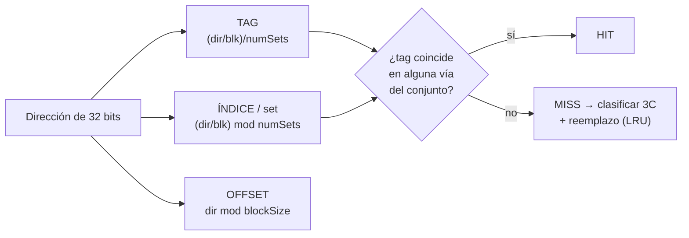
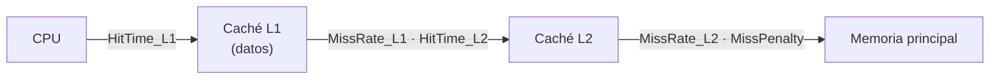

# Plan de validación manual — Módulo CACHE / Jerarquía de memoria (modo "Cache", estilo SMPcache)

## Objetivo y destinatario

Este documento permite a un **profesor de Arquitectura de Computadores de la UdL** validar, paso a
paso, que la vista **Cache** del simulador CREATOR (extensión UdL del proyecto PID, RISC-V/MIPS) es
**coherente con la teoría** de jerarquía de memoria. Concretamente se valida:

- La **descomposición de la dirección** de cada acceso en `TAG | ÍNDICE (set) | OFFSET`.
- El **patrón de aciertos/fallos** que predicen los principios de **localidad espacial** y **temporal**.
- La **clasificación de los fallos** según el modelo de las **3 C** (Compulsory / Capacity / Conflict)
  y, en particular, por qué el caso C produce fallos de **conflicto** y no de capacidad.
- El cálculo del **AMAT** (con un nivel y con jerarquía L1+L2).
- El efecto de las **políticas de reemplazo y escritura** (LRU, write-back/-through, write-allocate).

> El profesor no necesita programar: carga un ejemplo prefabricado, ejecuta, y compara lo que ve en la
> interfaz con los valores esperados que aquí se derivan de la teoría y del propio programa de prueba.

---

## Teoría aplicada — qué modela esta vista, de dónde viene, por qué es así

La vista replica el comportamiento de una **caché de datos** sobre el flujo ordenado de accesos a
memoria del programa. Modela los conceptos clásicos de la jerarquía de memoria:

> **Principio de localidad** (P&H COD-RISCV, §5.1). Los programas reutilizan datos y código próximos
> en el tiempo y el espacio:
> - **Localidad temporal:** un dato accedido tiende a volver a accederse pronto (bucles, contadores).
> - **Localidad espacial:** tras acceder a una posición, es probable acceder a las contiguas (recorrido
>   de vectores). La caché la explota trayendo **bloques** completos, no palabras sueltas.

> **Organización de la caché** (P&H COD-RISCV §5.3–5.4; Stallings, mapeo de caché). Una caché de
> `numLines` líneas y `ways` vías se organiza en `numSets = numLines / ways` **conjuntos**:
> - **Directo** (`ways = 1`): cada bloque va a un único conjunto.
> - **Asociativo por conjuntos** (`1 < ways < numLines`): el bloque puede ir a cualquier vía de su conjunto.
> - **Totalmente asociativo** (`ways = numLines`, `numSets = 1`): cualquier bloque en cualquier línea.

> **Descomposición de la dirección** (P&H COD-RISCV §5.3). La dirección de `n` bits se parte en:
>
> | Campo | Bits | Cálculo | Significado |
> |-------|------|---------|-------------|
> | OFFSET | `log2(blockSize)` | `dir mod blockSize` | byte/palabra dentro del bloque |
> | ÍNDICE (set) | `log2(numSets)` | `(dir / blockSize) mod numSets` | conjunto destino |
> | TAG | `32 − offsetBits − indexBits` | `(dir / blockSize) / numSets` | identifica el bloque dentro del conjunto |

> **Las 3 C de los fallos** (Hill & Smith, 1989; H&P CAQA, ap. B / §2.3):
> - **Compulsory (obligatorio):** primer acceso a un bloque que nunca estuvo en caché (fallo "en frío").
> - **Capacity (capacidad):** el conjunto de trabajo no cabe en la caché completa.
> - **Conflict (conflicto):** el bloque cabría en una caché **totalmente asociativa** del mismo tamaño,
>   pero el mapeo (directo o por conjuntos) lo expulsa porque **ese conjunto** está lleno.
>
> CREATOR clasifica con la técnica estándar: una **caché sombra totalmente asociativa LRU del mismo
> tamaño** (`numLines` entradas). Un fallo no compulsorio es **conflicto** si la sombra habría acertado,
> y **capacidad** en caso contrario (ver `memoryHierarchyModel.mts`).

> **AMAT** (Average Memory Access Time; P&H COD-RISCV §5.4, H&P CAQA ap. B):
> $$\text{AMAT} = \text{HitTime} + \text{MissRate} \times \text{MissPenalty}$$
> Con dos niveles (penalty local por nivel):
> $$\text{AMAT} = \text{HitTime}_{L1} + \text{MissRate}_{L1}\times\big(\text{HitTime}_{L2} + \text{MissRate}_{L2}\times\text{MissPenalty}\big)$$

> **Políticas de escritura** (Stallings; P&H COD-RISCV §5.4):
> - **Write-back:** la escritura solo modifica la línea (bit *dirty*); se vuelca a memoria al expulsarla
>   → genera **write-backs**.
> - **Write-through:** cada escritura va también a memoria.
> - **Write-allocate:** en un fallo de escritura se trae el bloque a caché (combina con write-back);
>   *no-write-allocate* escribe directo a memoria sin alojar.





---

## Preparación

1. **Arrancar CREATOR.** En `CREATOR/GCDA-UDL-creator` ejecutar `npx vite` y abrir
   <http://localhost:5210>.
2. **Arquitectura:** seleccionar **RISC-V (RV32IMFD)**.
3. **Cargar el ejemplo:** botón **Examples** → en el desplegable de **CONJUNTOS** elegir el grupo
   **`UdL · Test Cache`** → clicar el ejemplo **`Cache · localidad y conflicto`** (programa
   `examples/udl-tests/cache/cache_completo.s`).
4. **Ejecutar:** pulsar **Run** (ejecuta todo el programa de una vez).
5. **Abrir la vista:** pestaña **Datapath** → modo **Cache**. (Recalcula al instante; no hay que
   re-ejecutar al cambiar la configuración.)

**Configuración por defecto relevante** (de `DEFAULT_CACHE_CONFIG`):

| Parámetro | Valor por defecto | Comentario |
|-----------|-------------------|------------|
| Mapping | **Set-associative** | asociativo por conjuntos |
| Lines | **8** | líneas totales |
| Ways | **2** | vías por conjunto |
| Block (bytes) | **16** | = 4 palabras de 32 bits |
| → Conjuntos | **4** | `numSets = 8 / 2` |
| Replacement | **LRU** | menos recientemente usado |
| Write policy | **Write-back** | + bit *dirty* |
| Write-allocate | **Sí** | aloja en fallo de escritura |
| L1 hit time | **1** ciclo | |
| Memory penalty | **20** ciclos | penalización de fallo a memoria |
| Niveles | **L1 only** | (L2 desactivado) |
| Split I/D | **No** | caché unificada |

> **Importante (alcance del modelo):** la vista registra **solo accesos a DATOS** (`load`/`store`).
> El *fetch* de instrucciones **no** cuenta como acceso a esta caché, salvo que se active **Split I/D**
> (entonces la I-cache se alimenta del flujo de PC). En `cache/cache_completo.s` solo hay `lw` (lecturas) en los
> bucles, así que todos los accesos contabilizados son **lecturas**.

---

## El programa de prueba (`cache/cache_completo.s`)

Declara un vector `arr` de **48 palabras** (`.word 0..47`) y lo recorre en tres fases. **Solo los `lw`
cuentan como accesos.** Cada fase está diseñada para provocar un fenómeno teórico concreto:

```asm
.data
    arr: .word 0,1,2,...,47        # 48 palabras = 192 bytes = 12 bloques de 16 B
.text
main:
    # A) Localidad ESPACIAL: 16 palabras consecutivas (= 4 bloques)
    #    1 COMPULSORY por bloque + 3 HIT por bloque  -> 4 miss + 12 hit
A_loop: lw t3, 0(t0); addi t0,t0,4; ...   # i = 0..15

    # B) Localidad TEMPORAL: se REPITE el mismo recorrido de 16 palabras
    #    los 4 bloques (set 0..3) siguen en caché -> 16 HIT
B_loop: lw t3, 0(t0); ...                 # i = 0..15

    # C) CONFLICTO: 3 bloques que mapean al MISMO conjunto, en bucle x4
    #    offsets 0, 64, 128 -> bloques 0, 4, 8 -> index = bloque mod 4 = 0
C_loop: lw a0, 0(t4); lw a0, 64(t4); lw a0, 128(t4); ...  # 4 vueltas
```

**Por qué está diseñado así:**
- **A** aísla la **localidad espacial**: al traer bloques de 4 palabras, 3 de cada 4 accesos son acierto.
- **B** reutiliza exactamente los mismos bloques → demuestra **localidad temporal** (todo aciertos),
  porque los 4 bloques (índices 0–3) **caben** en las 8 líneas.
- **C** usa 3 bloques que colisionan en el **conjunto 0** (con solo 2 vías). La caché tiene 8 líneas
  libres en total, pero **ese conjunto** solo tiene 2 → el 3.er bloque expulsa al LRU y reaparece como
  **fallo de conflicto** en cada vuelta. Es la distinción clave conflicto ≠ capacidad.

**Recuento de accesos (todos lecturas):** A = 16, B = 16, C = 3 × 4 = 12 → **Accesses = 44**.

---

## Pasos de validación

> Los valores marcados como **(verificar)** dependen de la dirección base del segmento de datos en la
> ejecución concreta; el patrón cualitativo (qué campos cambian, qué clasificación aparece) es el que
> debe coincidir. Los recuentos numéricos sí están derivados del programa y del modelo.

| Paso | Acción | Dónde mirar (modo / zona UI) | Valor esperado | Justificación teórica |
|------|--------|------------------------------|----------------|-----------------------|
| **1** | Tras Run, abrir modo **Cache**. Leer el panel de **Estadísticas** superior. | Cache → fila de tarjetas (`Accesses`, `L1 hits`, …) | **Accesses = 44** | Solo cuentan `lw`: 16 (A) + 16 (B) + 12 (C). El fetch no cuenta (caché unificada de datos). |
| **2** | Situar el cursor en el **1.er acceso** (◀/▶ o `Live` → al inicio): pulsar ◀ hasta `1 / 44`. | Cache → barra **Access** (`◀ ▶ Live`, `tag/set/off`, HIT/MISS) | Dirección de `arr[0]`; **MISS · compulsory**; tira `tag … · set 0 · off 0`. | Primer acceso a un bloque nunca visto → **fallo compulsorio** (3 C). `off = dir mod 16 = 0`. |
| **3** | Avanzar ▶ al **2.º, 3.º, 4.º acceso** (`arr[1..3]`). | Cache → barra Access; rejilla `Set × Way` | **HIT** los tres; mismo `set` y `tag` que el paso 2; `off` = 4, 8, 12. | Localidad **espacial**: las otras 3 palabras del bloque ya están en caché. |
| **4** | Avanzar ▶ al **5.º acceso** (`arr[4]`, inicio del 2.º bloque). | Cache → barra Access | **MISS · compulsory**; `set 1`; `off 0`. | Nuevo bloque (`bloque = 1`, `index = 1 mod 4 = 1`) → otro fallo compulsorio. |
| **5** | Verificar la **descomposición** de un acceso concreto, p. ej. `arr[8]` (9.º acceso). | Cache → tira `a-tag / a-idx / a-off` | `off = 0`, `set = 2` (`bloque = 2 → 2 mod 4`), `tag` = `(dir/16)/4` **(verificar el valor absoluto)**. | Cálculo de campos: `offsetBits = log2(16) = 4`, `indexBits = log2(4) = 2`, `tagBits = 32 − 6 = 26`. |
| **6** | Terminada la fase A (cursor en `16 / 44`), leer estadísticas parciales mentalmente o usar el cursor para contar. | Cache → tarjetas + barra Access | Hasta aquí: **4 miss (todos Compulsory) + 12 hit**, hit rate parcial **75 %** (12/16). | Localidad espacial pura: 1 fallo de "arranque" por bloque, 3 aciertos. |
| **7** | Avanzar por toda la fase **B** (accesos 17–32). | Cache → barra Access (cada paso) | **16 HIT consecutivos**, sin fallos. | Localidad **temporal**: los 4 bloques (sets 0–3) siguen en caché (8 líneas ≥ 4 bloques). |
| **8** | Avanzar a la fase **C** (accesos 33–44) paso a paso, observando `set` y la rejilla del **conjunto 0**. | Cache → barra Access + rejilla `Set 0` (Way 0 / Way 1) | Los 3 bloques de C tienen **`set 0`** (`0,64,128 → bloques 0,4,8 → mod 4 = 0`). Tras llenarse las 2 vías, el 3.er bloque **expulsa** y reaparecen **MISS · conflict**. | Conflicto: caben en una totalmente asociativa del mismo tamaño, pero no en **ese conjunto** de 2 vías. |
| **9** | Al final (`Live` / `44 / 44`), leer los contadores **Compulsory / Capacity / Conflict**. | Cache → tarjetas `Compulsory`, `Capacity`, `Conflict` | **Compulsory = 6**, **Capacity = 0**, **Conflict = 9** (totales sobre todo el programa). | A aporta 4 compulsory; C aporta 2 compulsory nuevos (bloques 4 y 8 en su 1.ª vez) + 9 conflict en las expulsiones sucesivas. **Cero capacidad** → el caso C **no** es de capacidad. |
| **10** | Leer **L1 hit rate** y **AMAT**. | Cache → tarjetas `L1 hit rate`, `AMAT (cyc)` | hits = 44 − 15 = **29**; **hit rate ≈ 65.9 %** (29/44); miss rate ≈ 0.341; **AMAT = 1 + 0.341·20 ≈ 7.82 ciclos**. | `AMAT = HitTime + MissRate × MissPenalty = 1 + (15/44)·20`. Reproducir a mano y comparar con la tarjeta. |
| **11** | Verificar **Write-backs**. | Cache → tarjeta `Write-backs` | **0** | El programa solo hace `lw` (lecturas); no hay líneas *dirty* que volcar. |

> **Tabla de cálculo índice/offset para la config por defecto** (blockSize = 16, numSets = 4):
>
> | Concepto | Fórmula | Valor |
> |----------|---------|-------|
> | offsetBits | `log2(16)` | **4** |
> | indexBits | `log2(4)` | **2** |
> | tagBits | `32 − 4 − 2` | **26** |
> | índice de un bloque | `bloque mod 4` | bloques 0,4,8 → **0**; bloque 1 → 1; bloque 2 → 2 |
> | offset de `arr[i]` | `(4·i) mod 16` | i=0→0, i=1→4, i=2→8, i=3→12, i=4→0… |

---

## Variaciones (qué cambiar, qué debe pasar y por qué)

Pulsar **Cache config** (icono engranaje) para modificar la configuración; la vista **recalcula al
instante** sin re-ejecutar.

| # | Cambio en la configuración | Qué debe cambiar | Por qué (teoría) |
|---|----------------------------|------------------|------------------|
| **V1** | **Levels = L1 + L2** (L2 por defecto: Set, 32 líneas, 4 vías, hit 10). | Aparecen tarjetas **L2 hits / L2 hit rate**; el **AMAT global** baja respecto a L1-solo. | Jerarquía multinivel: los fallos de L1 los absorbe L2 antes de pagar la penalización completa. `AMAT = H_L1 + MR_L1·(H_L2 + MR_L2·MissPenalty)`. |
| **V2** | **Mapping = Direct** (1 vía → 8 conjuntos). | En C, los 3 bloques caen en `index = bloque mod 8` (0,4,0) → 0,4,**0**; siguen colisionando bloques 0 y 8 → persisten **Conflict**. Cambia la rejilla a 8×1. | Mapeo directo: máximo conflicto, un único sitio por bloque. |
| **V3** | **Ways = 4** (mapping Set; 8/4 → 2 conjuntos). | En C los 3 bloques caben en el **mismo conjunto de 4 vías** → **desaparecen los fallos de Conflict** de C (Conflict → 0 en C). | Más asociatividad reduce fallos de conflicto (H&P CAQA §2.3): el conjunto ya no se desborda. |
| **V4** | **Split I/D = Sí.** | Aparece selector **Data / Instr** y resumen **`I-cache % · D-cache %`**. La **I-cache** se llena con el flujo de **fetch (PC)** del programa. | Cachés separadas: instrucciones y datos no compiten; la I-cache mide localidad del **código** (bucles muy densos → alta tasa de acierto). |
| **V5** | **Write policy = Write-through**, y/o desactivar **Write-allocate**. | Con solo lecturas, **Write-backs = 0** en ambos casos (no hay escrituras). Para observar write-backs, usar un programa con `sw`. | Write-through escribe siempre a memoria; write-back solo al expulsar líneas *dirty*. El programa actual no escribe, así que sirve para constatar que **no** se generan write-backs espurios. |
| **V6** | **Block = 32 B** (8 palabras/bloque), config por lo demás por defecto. | En A: 16 palabras = **2 bloques** → solo **2 Compulsory** + 14 hit; hit rate A sube. | Bloques mayores explotan más localidad espacial (menos fallos compulsorios), a costa de más penalización por fallo. |

---

## Checklist de validación

Marcar cada casilla si lo observado en la herramienta coincide con lo esperado. Anotar el valor real y
si **coincide con la teoría (Sí/No)**.

- [ ] **C1.** `Accesses = 44` (solo `lw`; el fetch no cuenta). — coincide con teoría? Sí / No — notas: ______
- [ ] **C2.** 1.er acceso de A: **MISS · compulsory**, `off = 0`. — Sí / No — notas: ______
- [ ] **C3.** Accesos 2–4 de A: **HIT** (mismo bloque, `off` = 4/8/12). — Sí / No — notas: ______
- [ ] **C4.** 5.º acceso (`arr[4]`): **MISS · compulsory**, `set = 1`. — Sí / No — notas: ______
- [ ] **C5.** Descomposición de un acceso: `offsetBits=4`, `indexBits=2`, `tagBits=26`; `set` y `off` correctos. — Sí / No — notas: ______
- [ ] **C6.** Fase A completa: **4 miss + 12 hit** (hit rate parcial 75 %). — Sí / No — notas: ______
- [ ] **C7.** Fase B completa: **16 HIT** sin fallos (localidad temporal). — Sí / No — notas: ______
- [ ] **C8.** Fase C: los 3 bloques tienen **`set 0`** y aparecen fallos clasificados como **Conflict**. — Sí / No — notas: ______
- [ ] **C9.** Totales: **Compulsory = 6**, **Capacity = 0**, **Conflict = 9** (Capacity = 0 confirma que C es conflicto, no capacidad). — Sí / No — notas: ______
- [ ] **C10.** **L1 hit rate ≈ 65.9 %** (29/44) y **AMAT ≈ 7.82 ciclos** (`1 + (15/44)·20`), reproducible a mano. — Sí / No — notas: ______
- [ ] **C11.** **Write-backs = 0** (programa de solo lecturas). — Sí / No — notas: ______
- [ ] **C12.** **(V1)** Con L1+L2 aparecen tarjetas L2 y el AMAT global baja. — Sí / No — notas: ______
- [ ] **C13.** **(V3)** Con Ways = 4 desaparecen los fallos de Conflict de C. — Sí / No — notas: ______
- [ ] **C14.** **(V4)** Con Split I/D aparece el resumen `I-cache % · D-cache %` y el selector Data/Instr. — Sí / No — notas: ______

---

## Referencias

- D. A. Patterson, J. L. Hennessy. *Computer Organization and Design: The Hardware/Software Interface,
  RISC-V Edition* (P&H COD-RISCV), cap. 5 (§5.1 localidad; §5.3 fundamentos de caché y descomposición
  de dirección; §5.4 medidas de rendimiento, AMAT y políticas de escritura).
- J. L. Hennessy, D. A. Patterson. *Computer Architecture: A Quantitative Approach* (H&P CAQA),
  apéndice B (jerarquía de memoria, AMAT) y §2.3 (las 3 C, asociatividad).
- M. D. Hill, A. J. Smith. "Evaluating Associativity in CPU Caches", *IEEE Trans. Computers*, 1989
  (modelo de las 3 C: compulsory / capacity / conflict).
- W. Stallings. *Computer Organization and Architecture* (mapeo de caché directo/asociativo, políticas
  write-back/write-through, write-allocate).
- The RISC-V Instruction Set Manual, Vol. I (formatos R/I/S/B/U/J; codificación de `lw`, tipo I).
- Implementación de referencia: `src/core/trace/memoryHierarchyModel.mts` (modelo de caché y
  clasificación 3 C con caché sombra) y `src/web/components/simulator/CacheView.vue` (vista).

---

> **Financiación.** This work has been granted by the Ministerio de Ciencia, Innovación y Universidades
> (MICIU) AEI/10.13039/501100011033 under contract PID2023-146193OB-I00.
