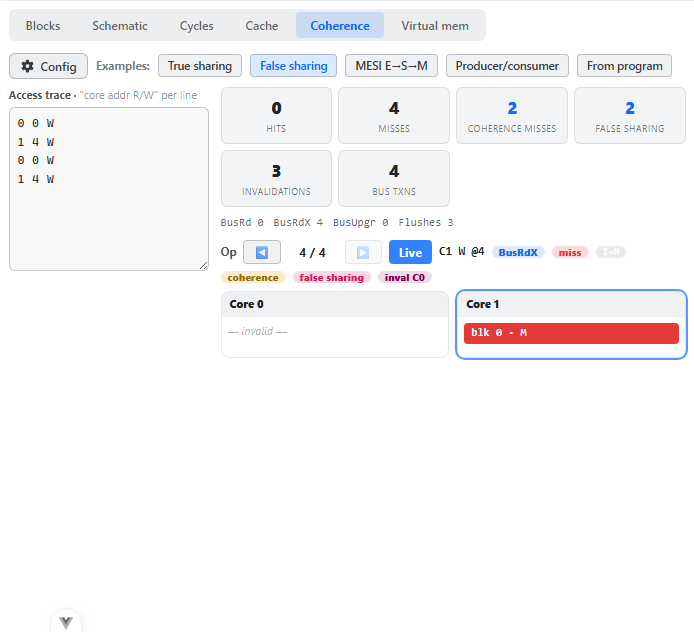
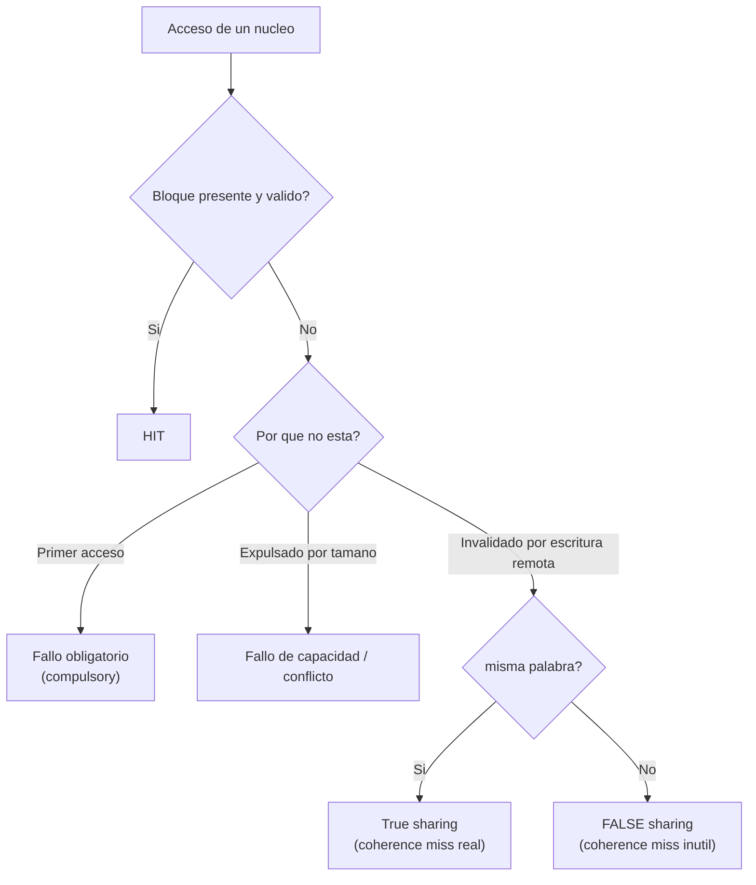
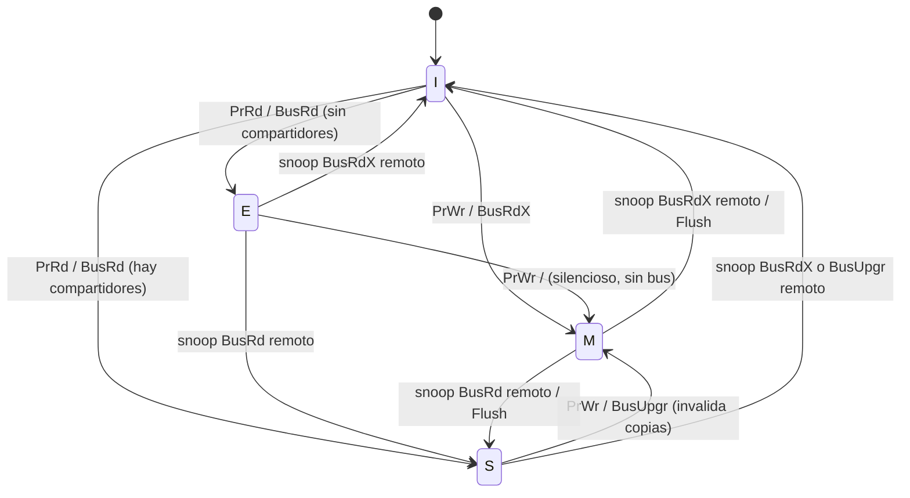
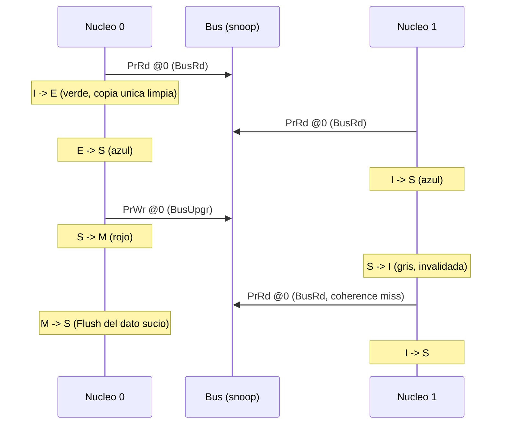
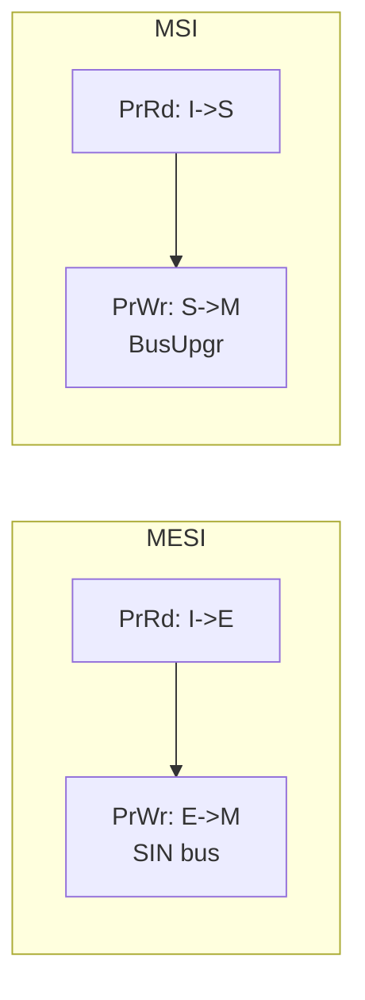

# Plan de validación manual — Módulo COHERENCIA DE CACHÉ MULTIPROCESADOR (modo «Coherence»)



> *Captura de referencia del simulador real (este plan describe que debe verse y por que).*

CREATOR (extensión UdL, PID RISC-V) · simulador de coherencia *snooping write-invalidate* (MESI/MSI) estilo SMPcaché multinúcleo.

---

## Objetivo y destinatario

**Qué se valida.** Que el modo **Coherence** de la pestaña *Datapath* reproduce fielmente la teoría de **coherencia de caché en multiprocesadores de memoria compartida**: el protocolo de **invalidación en escritura** sobre un bus con *snooping*, los estados **MESI** (Modified / Exclusive / Shared / Invalid) y sus transiciones, las transacciones de bus (**BusRd / BusRdX / BusUpgr / Flush**), el **fallo de coherencia** (la «4.ª C») y la distinción entre **true sharing** y **false sharing**.

**Para quién.** Profesorado de Arquitectura de Computadores (AC) de la UdL que debe confirmar, antes de usar la herramienta en clase, que cada número y cada cambio de color de la interfaz **coincide con la teoría** y que la justificación es trazable a una fuente (P&H, H&P, Papamarcos & Patel, Stallings, Culler/Singh/Gupta).

> **Nota de alcance.** CREATOR simula **un solo núcleo**. La coherencia multinúcleo, igual que en SMPcaché, se valida con una **traza de accesos multinúcleo** (no con un programa del desplegable *Examples*). Esa traza se introduce en el **editor de trazas** del propio modo Coherence o se carga con sus **ejemplos integrados** («True sharing», «False sharing», «MESI E→S→M», «Producer/consumer», «From program»). El botón *Examples* de la barra superior de CREATOR **no** interviene aquí.

---

## Teoría aplicada — qué modela esta vista, de dónde viene y por qué es así

### El problema de la coherencia

En un multiprocesador de memoria compartida, cada núcleo tiene su **caché privada**. Si dos cachés guardan copias del mismo bloque y uno lo escribe, las demás copias quedan **obsoletas**. El sistema es **coherente** si toda lectura devuelve el último valor escrito (con un orden de escrituras consistente). Fuente: **H&P CAQA, cap. 5** («*Thread-Level Parallelism*», sección de coherencia); **Stallings**, capítulo de organización multiprocesador.

### Snooping vs. directorio

- **Snooping (fisgoneo):** todas las cachés observan un **bus compartido**; cada controlador «escucha» las transacciones y reacciona sobre sus propias líneas. Escala mal pero es simple — es el modelo de buses de SMPcaché y el implementado en esta vista.
- **Directorio:** una estructura centralizada/distribuida registra qué núcleos comparten cada bloque; escala a muchos núcleos. **No** es lo que modela este simulador.

### Invalidación vs. actualización en escritura

Ante una escritura sobre un bloque compartido:

- **Write-invalidate** (el modelo de esta vista): el escritor obtiene **propiedad exclusiva** e **invalida** las demás copias. Las siguientes lecturas remotas fallarán y recargarán el dato actualizado.
- **Write-update / write-broadcast:** el escritor difunde el nuevo valor a todas las copias. Genera más tráfico de bus por escritura; hoy es minoritario.

> *«The protocol that has emerged as the dominant approach is the write-invalidate protocol… On a write, the writing processor invalidates all other copies of the item before changing its local copy.»* — H&P CAQA, cap. 5.

### Los estados MESI

| Estado | Color en la UI | Significado | ¿Copia única? | ¿Sucia (≠ memoria)? |
|--------|----------------|-------------|---------------|----------------------|
| **M** Modified | rojo | propietario único, modificada | sí | sí (debe hacer *flush*) |
| **E** Exclusive | verde | copia única, limpia | sí | no |
| **S** Shared | azul | copia compartida, limpia | no | no |
| **I** Invalid | gris | no válida / ausente | — | — |

**Por qué existe E (MESI vs. MSI).** En **MSI** una lectura sin compartidores deja la línea en **S**; si el mismo núcleo escribe después, debe emitir un **BusUpgr** para reclamar la propiedad. En **MESI**, esa primera lectura va a **E** (limpia y exclusiva), y la escritura posterior es un **E→M silencioso, sin transacción de bus**. El estado E **ahorra ese BusUpgr** en el patrón frecuente «leer y luego escribir un dato privado». Fuente: **Papamarcos & Patel (1984)** (protocolo que introduce el estado Exclusive); H&P CAQA cap. 5.

### El fallo de coherencia (4.ª C) y el false sharing

A las **3 C** de Hill & Smith (1989) — *compulsory*, *capacity*, *conflict* — los multiprocesadores añaden una cuarta: el **coherence miss** (fallo por **invalidación** previa de un bloque que ya teníamos). Se subdivide en:

- **True sharing miss:** dos núcleos acceden de verdad a **la misma palabra** del bloque. La invalidación es **necesaria** (comunican datos).
- **False sharing miss:** dos núcleos acceden a **palabras distintas** del **mismo bloque**. No comparten dato real, pero como la unidad de coherencia es el **bloque entero**, la escritura de uno invalida la copia del otro → tráfico de bus y fallos **inútiles**. Se mitiga con bloques más pequeños o reubicando los datos (padding/alineación). Fuente: H&P CAQA cap. 5; Culler/Singh/Gupta, *Parallel Computer Architecture*.



### Diagrama de transiciones MESI (write-invalidate, snooping)

Eventos **del procesador local**: PrRd (lee), PrWr (escribe). Eventos **del bus** (observados por *snoop*): BusRd, BusRdX, BusUpgr.



> En **MSI** se elimina el estado E: la arista `I --> E` no existe; toda lectura sin compartidores va a **S**, y la escritura posterior necesita siempre **BusUpgr** (`S --> M`).

### Secuencia de dos núcleos sobre la misma dirección (caso «MESI E→S→M»)



---

## Preparación

1. **Arrancar CREATOR.** En `CREATOR/GCDA-UDL-creator`:
   ```bash
   npx vite
   ```
   Abrir **http://localhost:5210**.
2. **Arquitectura:** seleccionar **RISC-V (RV32IMFD)** (irrelevante para el modelo de coherencia, pero deja la herramienta en estado coherente; el botón *From program* tomaría los accesos del programa cargado).
3. **Ir a la vista:** pestaña **Datapath** → botón de modo **Coherence**.
4. **Configuración por defecto** (botón *Config* / engranaje). Es la base de todos los pasos salvo que se indique lo contrario:

   | Parámetro | Valor por defecto | Efecto |
   |-----------|-------------------|--------|
   | Cores (núcleos) | **2** | nº de cachés privadas / columnas de la rejilla |
   | Protocol | **MESI** | con estado Exclusive |
   | Block (bytes) | **16** | unidad de coherencia → direcciones 0 y 4 caen en el **mismo bloque** (clave del false sharing) |
   | Lines/core | **4** | líneas totalmente asociativas por núcleo (reemplazo LRU) |

   > **Formato de la traza (editor de texto):** una operación por línea, `núcleo dirección R/W`. Ejemplos: `0 0 R` (núcleo 0 lee la dirección 0), `1 4 W` (núcleo 1 escribe la dirección 4). La dirección admite decimal (`16`) o hexadecimal (`0x10`). Líneas vacías o que empiezan por `#` se ignoran. Se descartan operaciones cuyo índice de núcleo sea ≥ *Cores*.

5. **Controles de recorrido.** El **cursor de operación** (`◀  n / total  ▶`) avanza/retrocede una operación; el botón **Live** salta al estado final. La rejilla **por núcleo** y el resumen de la operación actual (badge `from→to`, `hit/miss`, transacción, `coherence`, `false sharing`, `inval C…`) se actualizan en cada paso. Las **Estadísticas** y el registro de **bus** son acumulados de toda la traza.

---

## Los programas de prueba (ejemplos integrados)

Los cuatro ejemplos están diseñados como secuencias didácticas mínimas. Todas usan **bloque = 16 B**, por lo que la dirección `0` y la `4` son **dos palabras del mismo bloque 0** (la dirección 4 entra en false sharing; la 0 en true sharing). Trazas exactas tal como las carga la herramienta:

| Ejemplo | Traza (`núcleo dir R/W`) | Propósito |
|---------|--------------------------|-----------|
| **True sharing** | `0 0 R` · `1 0 R` · `1 0 W` · `0 0 R` | comunicación real sobre la **misma palabra** → coherence miss legítimo |
| **False sharing** | `0 0 W` · `1 4 W` · `0 0 W` · `1 4 W` | escrituras a **palabras distintas del mismo bloque** → invalidaciones y fallos inútiles |
| **MESI E→S→M** | `0 0 R` · `1 0 R` · `0 0 W` · `1 0 R` | recorrido canónico de estados E→S→M con invalidación y *flush* |
| **Producer/consumer** | `0 0 W` · `1 0 R` · `0 0 W` · `1 0 R` · `1 0 R` | productor escribe, consumidor lee; segunda lectura del consumidor es **hit** en S |

---

## Pasos de validación

> Los valores esperados se han **derivado del modelo** y verificado ejecutando el simulador. Donde el orden exacto de *flush* o un detalle dependa de la implementación se indica «(verificar en la herramienta)». Las **estadísticas son acumuladas**; los estados de la rejilla corresponden al **cursor** en esa operación.

### A) Ejemplo «MESI E→S→M» (configuración por defecto)

Cargar con el botón **MESI E→S→M**. Recorrer con el cursor desde `1/4`.

| Paso | Acción | Dónde mirar (modo/zona UI) | Valor esperado | Justificación teórica |
|------|--------|----------------------------|----------------|------------------------|
| 1 | Cursor en **op 1** (`0 0 R`) | Coherence → rejilla **Core 0** + badge de la operación | Core 0: `blk0 · E` (**verde**); badge `I→E`, `miss`, `BusRd`. Core 1: «— invalid —» | Primera lectura sin compartidores → **Exclusive**. P&H COD-RISCV cap. 5; Papamarcos & Patel (1984) |
| 2 | Avanzar a **op 2** (`1 0 R`) | rejilla Core 0 y Core 1 + bus | Core 1: `blk0 · S` (**azul**), badge `I→S`, `miss`, `BusRd`. Core 0 **baja** a `blk0 · S` (azul) | Segunda lectura de otro núcleo → ambos **Shared**; el snoop degrada E→S. H&P CAQA cap. 5 |
| 3 | Avanzar a **op 3** (`0 0 W`) | rejilla + badges + bus | Core 0: `blk0 · M` (**rojo**), badge `S→M`, **hit**, `BusUpgr`, `inval C1`. Core 1 → «— invalid —» (gris) | Escritura sobre línea **Shared**: BusUpgr reclama propiedad e **invalida** las demás. *Write-invalidate* |
| 4 | Avanzar a **op 4** (`1 0 R`) | rejilla + badge `coherence` + bus | Core 1: `blk0 · S` (azul), badge `I→S`, `miss`, **`coherence`**, `BusRd`. Core 0 baja `M→S`; hay **Flush** | Re-lectura de bloque **invalidado** = **coherence miss**; el propietario M hace *flush*. 4.ª C (H&P CAQA cap. 5) |
| 5 | Botón **Live** y leer **Estadísticas** | Coherence → tarjetas + línea de bus | Hits **1**, Misses **3**, Coherence misses **1**, False sharing **0**, Invalidations **1**, Bus txns **4**; BusRd **3**, BusRdX **0**, BusUpgr **1**, Flushes **1** | 1 escritura sobre S = BusUpgr; 3 lecturas con fallo = 3 BusRd; 1 invalidación; sin false sharing (misma palabra) |
| 6 | Estado final de la rejilla | rejilla Core 0 y Core 1 | Core 0: `blk0 · S`; Core 1: `blk0 · S` (ambos **azul**) | Tras el coherence miss ambos comparten la copia limpia → **Shared** |

### B) Ejemplo «True sharing» (configuración por defecto)

Cargar con **True sharing** (`0 0 R` · `1 0 R` · `1 0 W` · `0 0 R`).

| Paso | Acción | Dónde mirar | Valor esperado | Justificación teórica |
|------|--------|-------------|----------------|------------------------|
| 7 | op 1 (`0 0 R`) | rejilla Core 0 | `I→E`, miss, BusRd; Core 0 = `blk0 · E` (verde) | Lectura exclusiva inicial |
| 8 | op 2 (`1 0 R`) | rejilla ambos núcleos | ambos `blk0 · S` (azul); Core 1 `I→S`, miss, BusRd | Dos lectores → Shared |
| 9 | op 3 (`1 0 W`) | rejilla + bus | Core 1 `S→M` (rojo), hit, **BusUpgr**, `inval C0`; Core 0 → invalid | Escritura sobre S invalida al compañero |
| 10 | op 4 (`0 0 R`) | badge + rejilla | Core 0 `I→S`, miss, **`coherence`**; Core 1 baja `M→S`; **misma palabra (w0)** ⇒ **NO** false sharing | True sharing: la invalidación corresponde a un dato realmente compartido |
| 11 | Live → Estadísticas | tarjetas + bus | Hits 1, Misses 3, **Coherence misses 1**, **False sharing 0**, Invalidations 1, Bus txns 4; BusRd 3, BusUpgr 1, Flushes 1 | Hay coherence miss real, pero `false sharing = 0` porque todas las operaciones tocan la palabra 0 |

### C) Ejemplo «False sharing» (configuración por defecto — bloque 16 B)

Cargar con **False sharing** (`0 0 W` · `1 4 W` · `0 0 W` · `1 4 W`). Núcleo 0 usa la **palabra 0**, núcleo 1 la **palabra 4**, **mismo bloque 0**.

| Paso | Acción | Dónde mirar | Valor esperado | Justificación teórica |
|------|--------|-------------|----------------|------------------------|
| 12 | op 1 (`0 0 W`) | rejilla + bus | Core 0 `I→M` (rojo), miss, **BusRdX** | Write miss reclama propiedad exclusiva |
| 13 | op 2 (`1 4 W`) | rejilla + bus + badge | Core 1 `I→M`, miss, **BusRdX**, `inval C0`; Core 0 → invalid (y **flush** de su M) | Aunque sea otra palabra, la unidad de coherencia es el **bloque** → invalida a C0 |
| 14 | op 3 (`0 0 W`) | badges `coherence` **y** `false sharing` | Core 0 `I→M`, miss, **`coherence`** + **`false sharing`**, BusRdX, `inval C1` | Re-escritura de bloque invalidado por una palabra **distinta** ⇒ **false sharing** |
| 15 | op 4 (`1 4 W`) | badges | Core 1 `I→M`, miss, **`coherence`** + **`false sharing`**, BusRdX, `inval C0` | Simétrico al paso 14 |
| 16 | Live → Estadísticas | tarjetas + bus | Hits **0**, Misses **4**, Coherence misses **2**, **False sharing 2**, Invalidations **3**, Bus txns **4**; BusRdX **4**, BusRd 0, BusUpgr 0, Flushes **3** | Todas las escrituras fallan por ping-pong de invalidación; el contador **False sharing > 0** pese a no compartir dato real |
| 17 | Estado final | rejilla | Core 0: «— invalid —»; Core 1: `blk0 · M` (rojo) | La última escritora (C1) retiene la copia Modified; C0 quedó invalidado |

### D) Ejemplo «Producer/consumer» (configuración por defecto)

Cargar con **Producer/consumer** (`0 0 W` · `1 0 R` · `0 0 W` · `1 0 R` · `1 0 R`).

| Paso | Acción | Dónde mirar | Valor esperado | Justificación teórica |
|------|--------|-------------|----------------|------------------------|
| 18 | op 1 (`0 0 W`) | rejilla + bus | Core 0 `I→M`, miss, **BusRdX** | Productor adquiere propiedad para escribir |
| 19 | op 2 (`1 0 R`) | rejilla + bus | Core 1 `I→S`, miss, **BusRd**; Core 0 baja `M→S` (**flush** del dato) | El consumidor lee; el productor M cede vía Flush → ambos S |
| 20 | op 3 (`0 0 W`) | bus + badge | Core 0 `S→M`, hit, **BusUpgr**, `inval C1` | Productor reescribe sobre S → BusUpgr e invalida al consumidor |
| 21 | op 4 (`1 0 R`) | badge `coherence` | Core 1 `I→S`, miss, **`coherence`**, BusRd; Core 0 `M→S` (flush) | Consumidor re-lee bloque invalidado = coherence miss |
| 22 | op 5 (`1 0 R`) | rejilla + badge | Core 1 `S→S`, **hit**, transacción `—` | Segunda lectura consecutiva ya está en caché (S) → **hit sin bus** |
| 23 | Live → Estadísticas | tarjetas + bus | Hits **2**, Misses 3, **Coherence misses 1**, False sharing 0, Invalidations 1, Bus txns 4; BusRd **2**, BusRdX **1**, BusUpgr **1**, Flushes **2** | Patrón productor-consumidor: comunicación real (true sharing), sin false sharing |

---

## Variaciones (qué cambiar, qué debe cambiar y por qué)

### V1 — MESI vs. MSI: el ahorro del estado Exclusive

Los **cuatro ejemplos integrados producen las mismas estadísticas en MESI y en MSI**, porque ninguno contiene el patrón crítico «un único núcleo lee y luego escribe sin que otro lea entremedias» (en ellos la escritura siempre cae sobre **Shared**, que en ambos protocolos necesita BusUpgr). Lo que **sí** cambia a nivel de operación: en MSI la **primera lectura va a `I→S`** en vez de `I→E` (no hay verde).

Para ver el ahorro de bus del estado E, **vaciar el editor** y escribir esta traza mínima de un solo núcleo (un solo lector-escritor del dato):

```
0 0 R
0 0 W
```

| Configuración | op 1 (`0 0 R`) | op 2 (`0 0 W`) | Bus txns totales |
|---------------|----------------|----------------|------------------|
| **MESI** (defecto) | `I→E` (verde), miss, BusRd | `E→M`, hit, transacción **`—` (silenciosa)** | **1** (solo el BusRd) |
| **MSI** (Config → Protocol = MSI) | `I→S` (azul), miss, BusRd | `S→M`, hit, **BusUpgr** | **2** (BusRd + BusUpgr) |

**Qué validar:** al pasar a MSI aparece **un BusUpgr extra** y `Bus txns` sube de 1 a 2. *Justificación:* el estado E permite la transición **E→M silenciosa** (la copia ya era única y limpia), evitando el BusUpgr. Es la razón de ser de MESI frente a MSI. Fuente: Papamarcos & Patel (1984); H&P CAQA cap. 5.



### V2 — Tamaño de bloque: eliminar el false sharing

Con el ejemplo **False sharing** cargado, abrir **Config** y cambiar **Block** de **16** a **4** bytes (dejar el resto por defecto).

**Qué cambia.** Con bloque 4 B, la dirección `0` cae en el **bloque 0** y la dirección `4` en el **bloque 1** → núcleos 0 y 1 trabajan en **bloques distintos**, sin solaparse.

| Métrica | Bloque 16 B (false sharing) | Bloque 4 B (corregido) |
|---------|-----------------------------|------------------------|
| Misses | 4 | **2** (solo los obligatorios) |
| Coherence misses | 2 | **0** |
| **False sharing** | **2** | **0** |
| Invalidations | 3 | **0** |
| Bus txns | 4 (4× BusRdX) | **2** (2× BusRdX) |
| Hits | 0 | **2** |

**Qué validar:** los contadores **False sharing** e **Invalidations** caen a **0** y aparecen hits. *Justificación:* el false sharing es un artefacto de la **granularidad** del bloque; reduciéndolo (o separando/alineando los datos) las palabras dejan de compartir bloque y desaparecen las invalidaciones inútiles. Fuente: H&P CAQA cap. 5; Culler/Singh/Gupta.

> Aviso didáctico: bloques más pequeños eliminan el false sharing **pero** reducen la explotación de la localidad espacial (más fallos obligatorios en programas reales). Es un compromiso, no una mejora gratuita.

### V3 — Número de núcleos

Con cualquier ejemplo, subir **Cores** a 3–4 y añadir operaciones de los nuevos núcleos en la traza (p. ej. `2 0 R`). **Qué validar:** una escritura invalida **todas** las copias compartidas a la vez (el badge `inval C…` lista varios núcleos; *Invalidations* crece en consecuencia). *Justificación:* el bus de snooping difunde la invalidación a todos los fisgones simultáneamente.

---

## Checklist de validación

Marcar cada casilla tras comprobarlo en la herramienta. Anotar el valor observado y si coincide con la teoría.

**Ejemplo «MESI E→S→M»**
- [ ] op1: primera lectura → **E** (verde), `BusRd`, miss. *¿coincide con teoría? Sí / No — nota: __________*
- [ ] op2: segunda lectura de otro núcleo → ambos **S** (azul), Core 0 baja E→S. *Sí / No — __________*
- [ ] op3: escritura sobre S → **M** (rojo), `BusUpgr`, **invalida** al otro (gris). *Sí / No — __________*
- [ ] op4: re-lectura del invalidado → badge **`coherence`**, `BusRd`, flush del propietario. *Sí / No — __________*
- [ ] Estadísticas finales: Hits 1 · Misses 3 · Coherence 1 · False sharing 0 · Inval 1 · BusRd 3 · BusUpgr 1 · Flushes 1. *Sí / No — __________*

**Ejemplo «True sharing»**
- [ ] La invalidación ocurre sobre la **misma palabra** (w0) y produce coherence miss. *Sí / No — __________*
- [ ] **False sharing = 0** (no hay falso compartir). *Sí / No — __________*

**Ejemplo «False sharing»**
- [ ] Direcciones 0 y 4 comparten **bloque 0** (bloque = 16 B). *Sí / No — __________*
- [ ] Escrituras a palabras distintas se **invalidan** mutuamente (ping-pong). *Sí / No — __________*
- [ ] Badges **`coherence`** + **`false sharing`** en op3 y op4. *Sí / No — __________*
- [ ] Estadísticas: **False sharing = 2**, Invalidations 3, BusRdX 4. *Sí / No — __________*

**Ejemplo «Producer/consumer»**
- [ ] op2: el consumidor lee y el productor M hace **flush** (M→S). *Sí / No — __________*
- [ ] op5: segunda lectura consecutiva es **hit** sin transacción de bus. *Sí / No — __________*

**Variación MESI vs. MSI (traza `0 0 R` / `0 0 W`)**
- [ ] MESI: `E→M` **silenciosa** (Bus txns = 1). *Sí / No — __________*
- [ ] MSI: `S→M` con **BusUpgr** (Bus txns = 2). *Sí / No — __________*

**Variación tamaño de bloque (False sharing, bloque 4 B)**
- [ ] False sharing e Invalidations caen a **0**; aparecen hits. *Sí / No — __________*

**Coherencia general del modelo**
- [ ] Colores de la rejilla = estados MESI (M rojo, E verde, S azul, I gris). *Sí / No — __________*
- [ ] `Bus txns` = `BusRd + BusRdX + BusUpgr` en todos los casos. *Sí / No — __________*
- [ ] Cada transición operación-a-operación es justificable por el protocolo write-invalidate. *Sí / No — __________*

---

## Referencias

- **D. A. Patterson, J. L. Hennessy.** *Computer Organization and Design: The Hardware/Software Interface, RISC-V Edition.* Morgan Kaufmann. — **Cap. 5** (jerarquía de memoria; introducción a coherencia y *false sharing* en multinúcleo).
- **J. L. Hennessy, D. A. Patterson.** *Computer Architecture: A Quantitative Approach* (6.ª ed.). Morgan Kaufmann. — **Cap. 5** (multiprocesadores de memoria compartida, coherencia *snooping*, write-invalidate, coherence misses, true/false sharing); **Apéndice B / Cap. 2** (las 3 C de los fallos).
- **M. S. Papamarcos, J. H. Patel** (1984). *A low-overhead coherence solution for multiprocessors with private cache memories.* ISCA. — protocolo con estado **Exclusive** (base de MESI).
- **M. D. Hill, A. J. Smith** (1989). *Evaluating associativity in CPU caches.* IEEE Trans. Computers. — modelo de las **3 C** (compulsory / capacity / conflict), ampliado a la 4.ª C de coherencia en multiprocesadores.
- **D. E. Culler, J. P. Singh, A. Gupta.** *Parallel Computer Architecture: A Hardware/Software Approach.* Morgan Kaufmann. — protocolos de coherencia, snooping y false sharing.
- **W. Stallings.** *Computer Organization and Architecture.* Pearson. — organización multiprocesador, mapeo de caché, **MESI** y memoria virtual.
- **Especificación RISC-V** (*The RISC-V Instruction Set Manual, Vol. I*) — modelo de memoria y arquitectura base RV32I.

---

### Financiación

> This work has been granted by the Ministerio de Ciencia, Innovación y Universidades (MICIU) AEI/10.13039/501100011033 under contract PID2023-146193OB-I00.

> **TODO (colaboración inter-grupo):** el simulador CREATOR es una extensión compartida del proyecto PID (FACTOS, WP3/Obj 3.3, GCD-UdL) con el grupo HPCA4SE-UAB. Antes de difundir este material fuera de la UdL, **consultar con la UAB** si deben añadirse reconocimientos de financiación adicionales (p. ej. de la línea CREATOR/UAB).
