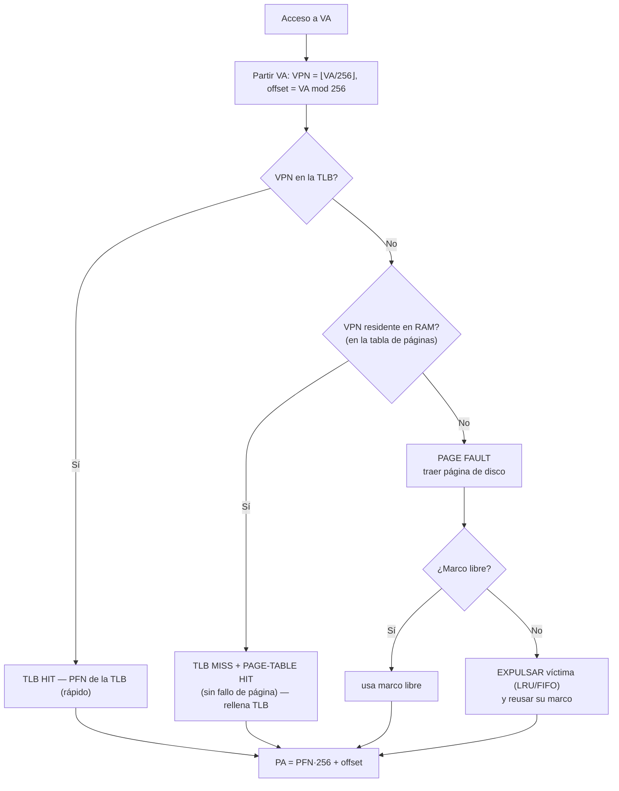
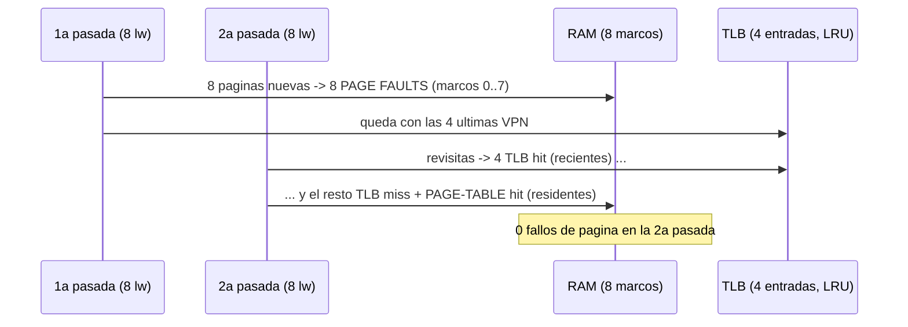

# 05 · Memoria virtual — TLB y paginación (modo *Virtual mem*)

Plan de **validación manual** del modo **Datapath → Virtual mem** de la extensión docente de CREATOR
(RISC-V/MIPS, proyecto PID de la UdL). Sustituye, en la parte de memoria virtual, a las prácticas
clásicas de paginación y TLB.

## Objetivo y destinatario

**Qué se valida.** Que la vista de memoria virtual implementa correctamente la **traducción de
direcciones** (VA → VPN+offset → PA), el **acierto/fallo de TLB**, el **acierto en tabla de páginas**,
el **fallo de página** (*page fault*) con una RAM finita, las **políticas de reemplazo LRU/FIFO** y el
fenómeno de **hiperpaginación (*thrashing*)** cuando el conjunto de trabajo no cabe en los marcos de RAM.

**Para quién.** Profesorado de Arquitectura de Computadores de la UdL. El documento permite: (1) cargar
el ejemplo, (2) seguir pasos numerados, (3) ver **exactamente** dónde aparece cada valor en la interfaz,
y (4) confirmar que coincide con la teoría, con su **justificación** y **fuente**.

> Evaluador **humano**. Complementa a los tests automáticos (`npm run test:unit`,
> [`tests/unit/virtualMemoryModel.spec.ts`](../unit/virtualMemoryModel.spec.ts); `npm run test:e2e`,
> [`tests/e2e/advanced-memory.spec.ts`](../e2e/advanced-memory.spec.ts)). Aquí se juzga la **coherencia
> con la teoría**.

---

## Teoría aplicada

### Por qué existe la memoria virtual

> La memoria virtual da a **cada proceso** su propio espacio de direcciones, lo **protege** del resto y
> crea la **ilusión** de una memoria principal mayor que la RAM física, usando el disco como respaldo.
> La unidad de gestión es la **página** (un bloque de tamaño fijo); su equivalente físico es el **marco**
> (*frame*). La correspondencia página→marco la guarda la **tabla de páginas**, indexada por el **número
> de página virtual (VPN)**; cada entrada tiene un **bit de presente (*valid*)** que indica si la página
> está residente en RAM.
> — *P&H COD-RISCV, §5.7 (Virtual Memory); Stallings, cap. 8 (Virtual Memory).*

### Traducción VA → PA

Con páginas de tamaño potencia de dos, la dirección virtual se parte en dos campos **sin aritmética**:
los bits bajos son el **desplazamiento (offset)** dentro de la página y los altos el **VPN**. El marco
físico (**PFN**) sustituye al VPN; el offset **no cambia**.

| Magnitud | Fórmula | Para página = 256 B |
|----------|---------|----------------------|
| Bits de offset | `offset_bits = log2(pageSize)` | `log2(256) = 8` |
| Offset | `offset = VA mod pageSize` | bits `[7:0]` de la VA |
| VPN | `VPN = ⌊VA / pageSize⌋` | bits `[31:8]` de la VA |
| Dirección física | `PA = PFN · pageSize + offset` | `PA = PFN·256 + offset` |

> Estas tres fórmulas son **exactamente** las que aplica el modelo de la herramienta
> ([`src/core/trace/virtualMemoryModel.mts`](../../src/core/trace/virtualMemoryModel.mts)):
> `vpn = Math.floor(address / pageSize)`, `offset = address % pageSize`,
> `physical = pfn * pageSize + offset`. Verificado en el test *"translates VA → PA"*.

### La TLB: caché de traducciones

> Recorrer la tabla de páginas en cada acceso es caro (uno o más accesos a memoria adicionales). La
> **TLB (*Translation Lookaside Buffer*)** es una caché pequeña y rápida de traducciones VPN→PFN
> recientes. Un **acierto de TLB** resuelve la traducción sin tocar la tabla de páginas. La **tasa de
> acierto de TLB** mide su eficacia; por localidad suele ser muy alta (>99 % en programas reales).
> — *P&H COD-RISCV, §5.7 (Making Address Translation Fast: the TLB).*

La jerarquía de decisión por acceso (la que implementa la vista) es:



### Reemplazo y *thrashing*

> Cuando ocurre un fallo de página y **no hay marcos libres**, se **expulsa** una página residente
> según la política de reemplazo: **LRU** (la menos recientemente usada) o **FIFO** (la que entró antes).
> Si el **conjunto de trabajo** (páginas activas a la vez) **no cabe** en los marcos disponibles, el
> sistema expulsa páginas que volverá a necesitar de inmediato y entra en **hiperpaginación
> (*thrashing*)**: casi todos los accesos provocan fallo de página y el rendimiento se desploma.
> — *P&H COD-RISCV, §5.7; Stallings, cap. 8 (Replacement Policy, Thrashing).*

> Nota de modelo: la vista trata RAM como un conjunto de **marcos físicos**; el "fallo de página" se
> dispara cuando la página no es residente. No se modela explícitamente el coste en ciclos del disco
> (no aplica AMAT aquí); el indicador docente es el **número de fallos de página** y su **tasa**.

---

## Preparación

| Elemento | Valor |
|----------|-------|
| Arrancar | en `CREATOR/GCDA-UDL-creator`: `npx vite` → abrir `http://localhost:5210` |
| Arquitectura | **RISC-V (RV32IMFD)** |
| Grupo de ejemplos (botón **Examples** → desplegable de **conjuntos**) | **`UdL · Test Virtual memory`** |
| Ejemplo a clicar | *Memoria virtual · paginación y TLB* (`vmemory/vmemory_completo.s`) |
| Ejecución | botón **Run** (todo) o **Step** (paso a paso) |
| Vista | pestaña **Datapath** → modo **Virtual mem** (botón) |

**Configuración por defecto (la que asume este plan)** — confirmada en `DEFAULT_VM_CONFIG`:

| Parámetro (panel *Memory config*) | Valor por defecto |
|-----------------------------------|-------------------|
| Page size (bytes) | **256** |
| TLB entries | **4** |
| RAM frames | **8** |
| TLB replacement | **LRU** |
| Page replacement | **LRU** |

> La vista **recalcula al instante** al cambiar la configuración (rótulo *"Recomputes instantly — no
> re-run needed"*): no hace falta re-ejecutar para probar variaciones. El cambio se guarda en
> `localStorage`; si quedó algo de una sesión anterior, pulsa **Reset** para volver a los valores de
> arriba.

> La vista solo lee el **flujo de accesos a DATOS** (loads/stores); las **lecturas de instrucción NO**
> se incluyen ([`memoryAccessHistory.mts`](../../src/core/trace/memoryAccessHistory.mts)). Por eso el
> stream que ves son justamente los `lw` del programa.

---

## El programa de prueba (`vmemory/vmemory_completo.s`)

Reserva un array de **2048 B = 8 páginas de 256 B** y lo recorre **dos veces**:

```asm
.data
    big: .zero 2048           # 8 paginas de 256 B
.text
main:
    # --- 1a pasada: 1 palabra por pagina -> nueva pagina cada vez ---
    la   t0, big
    li   t2, 8                # 8 paginas
P1: beq  t1, t2, P1_end
    lw   t3, 0(t0)            # toca pagina nueva -> TLB miss + PAGE FAULT
    addi t0, t0, 256          # salta a la siguiente pagina (stride = pagina)
    addi t1, t1, 1
    j    P1
    # --- 2a pasada: revisita las mismas 8 paginas ---
    la   t0, big
P2: ...
    lw   t3, 0(t0)            # revisita -> TLB hit / page-table hit
```

**Diseño y por qué.** El **stride = 256 B = una página** garantiza que cada `lw` de la 1ª pasada cae en
una **página distinta** → primer toque de 8 páginas nuevas. La 2ª pasada **revisita** esas mismas 8
páginas en el mismo orden → permite observar **aciertos de TLB**, **aciertos de tabla de páginas** y, si
la RAM es estrecha, **reaparición de fallos** (*thrashing*).

### Direcciones reales y descomposición VPN/offset

El segmento `.data` de RV32IMFD empieza en **`0x00200000`**
([`architecture/RISCV/RV32IMFD.yml`](../../architecture/RISCV/RV32IMFD.yml): `data.start = 0x00200000`).
Esa base es múltiplo exacto de 256 (`0x200000 / 256 = 0x2000`), así que `big` queda alineado a página
(offset 0). Las 8 páginas tocadas son:

| Acceso `lw` | VA (hex) | VA (dec) | VPN = ⌊VA/256⌋ | offset = VA mod 256 |
|:-----------:|:--------:|:--------:|:--------------:|:-------------------:|
| 1 | `0x200000` | 2097152 | 8192 (`0x2000`) | 0 |
| 2 | `0x200100` | 2097408 | 8193 (`0x2001`) | 0 |
| 3 | `0x200200` | 2097664 | 8194 (`0x2002`) | 0 |
| 4 | `0x200300` | 2097920 | 8195 (`0x2003`) | 0 |
| 5 | `0x200400` | 2098176 | 8196 (`0x2004`) | 0 |
| 6 | `0x200500` | 2098432 | 8197 (`0x2005`) | 0 |
| 7 | `0x200600` | 2098688 | 8198 (`0x2006`) | 0 |
| 8 | `0x200700` | 2098944 | 8199 (`0x2007`) | 0 |

> En la 1ª pasada el flujo de accesos a datos son exactamente estas 8 VA (más, si el ensamblado emite
> algún acceso adicional de inicialización: **(verificar en la herramienta)** que el contador *Accesses*
> y la columna *VA* coinciden con esta tabla). La 2ª pasada repite las **mismas 8 VPN**.

---

## Pasos de validación

> Dónde mirar (zonas de la vista *Virtual mem*): **(A) Tiles de estadísticas** arriba — *Accesses,
> TLB hit rate, TLB hits, Page-table hits, Page faults, RAM frames*. **(B) Cursor de acceso** —
> `Access ◀ N/Total ▶ Live`. **(C) Fila de traducción** — `VA … → VPN/off → [TLB hit|miss] →
> [PAGE FAULT|page-table hit] → PFN / PA`. **(D) Tablas** — *TLB (n/4)* y *Resident pages — RAM (n/8
> frames)*. **(E) Panel *Memory config*** (botón engranaje).

| Paso | Acción | Dónde mirar (modo/zona) | Valor esperado | Justificación teórica |
|:----:|--------|--------------------------|----------------|------------------------|
| 1 | Cargar `UdL · Test Virtual memory` → ejemplo `vmemory/vmemory_completo.s`; pulsar **Run** | Pestaña Datapath → **Virtual mem** | La vista muestra estadísticas y tablas (no el aviso *"Run a program with loads/stores…"*) | La vista consume el stream de **accesos a datos** capturado al ejecutar. |
| 2 | Verificar config por defecto (botón **Memory config**) | (E) Panel de config | Page size **256**, TLB **4**, RAM **8**, ambos *replacement* **LRU** | Es la geometría de este plan: 8 páginas, TLB chica, RAM justa para las 8. |
| 3 | Leer total de accesos | (A) tile **Accesses** | ≥ 16 (8 + 8); contar (verificar en la herramienta) si hay accesos extra de inicio | Dos pasadas de 8 `lw`. |
| 4 | Poner el cursor en el **1er** acceso (`◀` hasta `1/Total`) | (B) cursor + (C) fila de traducción | `VA 0x200000 → VPN 8192 off 0 → TLB miss → PAGE FAULT → PFN 0 → PA 0x0` | Primer toque: no está en TLB ni residente → **fallo de página**; primer marco libre = PFN 0; `PA = 0·256+0 = 0`. |
| 5 | Comprobar descomposición VA→VPN+offset en varios accesos de la 1ª pasada | (C) campos **VPN** y **off** | VPN = 8192…8199, **off = 0** en todos (ver tabla de arriba) | `VPN=⌊VA/256⌋`, `offset=VA mod 256`; base de `.data` alineada a página. |
| 6 | Avanzar el cursor por los 8 accesos de la **1ª pasada** (`▶`) | (C) badges + (D) tablas | Los **8** son `TLB miss` + `PAGE FAULT`; *Resident pages — RAM* crece 1→8; PFN asignados 0..7 | 8 páginas nuevas, todas caben en 8 marcos → 8 fallos *compulsorios* (de arranque), sin expulsión. |
| 7 | Tras la 1ª pasada, leer fallos de página | (A) tile **Page faults** | **8** | Un fallo por cada una de las 8 páginas nuevas (caben todas en RAM=8). |
| 8 | Mirar la tabla **Resident pages — RAM** al acabar la 1ª pasada | (D) tabla derecha | **8/8 frames**, VPN 8192..8199 ↔ PFN 0..7 | Las 8 páginas quedan residentes; no hubo expulsiones. |
| 9 | Mirar la tabla **TLB** al acabar la 1ª pasada | (D) tabla izquierda | **4/4**, con las **4 últimas** VPN (8196..8199) | TLB de 4 entradas, LRU: solo sobreviven las 4 traducciones más recientes. |
| 10 | Avanzar por los 8 accesos de la **2ª pasada** | (C) badges | **0** `PAGE FAULT`; aparecen `TLB hit` y `TLB miss + page-table hit` | RAM=8: todo residente → sin fallos. TLB=4: algunas VPN ya no están en TLB pero **sí** en RAM → *page-table hit*. |
| 11 | Leer **Page faults** tras la 2ª pasada | (A) tile **Page faults** | sigue **8** (no aumenta) | No se expulsó nada; revisitar páginas residentes **no** causa fallo de página. |
| 12 | Leer aciertos de TLB y de tabla de páginas de la 2ª pasada | (A) tiles **TLB hits** / **Page-table hits** | reparto entre *TLB hit* y *page-table hit* (conteo exacto **(verificar en la herramienta)**, depende del orden LRU del TLB) | Con TLB=4 sobre 8 páginas, no todas las revisitas aciertan en TLB; las que fallan en TLB aciertan en la tabla. |
| 13 | Leer la **tasa de acierto de TLB** | (A) tile **TLB hit rate** | valor `%` (verificar); debe ser < 100 % por la mezcla de hits/misses | `tlbHitRate = TLB hits / Accesses`. |

> **Nota sobre conteos de la 2ª pasada.** La herramienta usa una TLB **completamente asociativa** con
> LRU. El número exacto de *TLB hit* frente a *page-table hit* en la 2ª pasada depende del estado LRU del
> TLB al terminar la 1ª pasada, por eso se marca *(verificar en la herramienta)*. Lo **invariante** y
> exigible es: **0 fallos de página** en la 2ª pasada y **8** acumulados en total.



---

## Variaciones

> No hace falta re-ejecutar el programa: cambia el valor en **Memory config** y la vista **recalcula al
> instante** sobre el mismo flujo de accesos.

| # | Cambio en *Memory config* | Qué debe cambiar | Por qué (teoría) |
|:-:|---------------------------|------------------|-------------------|
| V1 | Preset **`Tight RAM (LRU)`** (RAM frames → **3**, LRU) | En la 1ª pasada solo caben 3 páginas → al traer la 4ª empiezan las **expulsiones** (badge `evict VPN …`); en la 2ª pasada **reaparecen `PAGE FAULT`** y *Page faults* sube muy por encima de 8 | El **conjunto de trabajo (8)** no cabe en **3 marcos** → **thrashing**: se expulsan páginas que se vuelven a pedir enseguida. |
| V2 | Preset **`Tight RAM (FIFO)`** (RAM → 3, **FIFO**) y comparar fallos con V1 | Distinto número de **Page faults** que con LRU sobre el mismo patrón de reúso | LRU vs FIFO eligen **víctimas distintas**; en patrones con reúso, LRU suele provocar **≤** fallos que FIFO (verificado en el test *"LRU causes fewer page faults than FIFO"*). |
| V3 | Preset **`Roomy RAM`** (RAM → **16**) | Vuelve al comportamiento de RAM holgada: **8** fallos totales, **0** en la 2ª pasada | Con marcos de sobra no hay expulsiones; solo quedan los fallos **compulsorios** de primer toque. |
| V4 | **TLB entries → 8** (resto por defecto, RAM=8) | En la 2ª pasada **todas** las revisitas dan `TLB hit` (0 *page-table hit*); **TLB hit rate** sube | Con TLB ≥ nº de páginas activas, todas las traducciones caben en TLB → no se recorre la tabla. |
| V5 | **TLB entries → 1** | En la 2ª pasada casi todo es `TLB miss + page-table hit`; **TLB hit rate** se hunde (pero **Page faults** sigue 8) | TLB minúscula → poca localidad capturada; pero la **residencia en RAM** no cambia → sin fallos de página. |
| V6 | **Page size → 512** (resto por defecto) | El array de 2048 B pasa a ocupar **4 páginas**; cambian *VPN/offset* (offset = `log2(512)=9` bits) y bajan los fallos a **4** | El tamaño de página redefine la granularidad: `offset_bits=log2(pageSize)`; menos páginas → menos fallos compulsorios. |

> Tras cada variación, pulsa **Reset** antes de la siguiente para partir de la config por defecto.

---

## Checklist de validación

Marca cada comprobación e indica si **coincide con la teoría** (Sí/No) y notas de cualquier discrepancia.

**Preparación y traducción**

- [ ] La vista *Virtual mem* muestra datos tras **Run** (no el aviso de programa vacío). — coincide con teoría: Sí / No — _nota:_
- [ ] Config por defecto correcta: página **256**, TLB **4**, RAM **8**, LRU/LRU. — Sí / No — _nota:_
- [ ] 1er acceso: `VA 0x200000 → VPN 8192, off 0`. — Sí / No — _nota:_
- [ ] En la 1ª pasada **todos** los offset son **0** y los VPN van **8192→8199**. — Sí / No — _nota:_
- [ ] La PA del 1er acceso es `0x0` (`PFN 0 · 256 + 0`). — Sí / No — _nota:_

**Aciertos, fallos y tablas (config por defecto)**

- [ ] La 1ª pasada produce **8 TLB miss + 8 PAGE FAULT**. — Sí / No — _nota:_
- [ ] Tras la 1ª pasada, *Resident pages — RAM* = **8/8** (VPN 8192..8199). — Sí / No — _nota:_
- [ ] La tabla **TLB** queda **4/4** con las 4 VPN más recientes (LRU). — Sí / No — _nota:_
- [ ] La 2ª pasada produce **0 PAGE FAULT**. — Sí / No — _nota:_
- [ ] Tile **Page faults** total = **8** (no aumenta en la 2ª pasada). — Sí / No — _nota:_
- [ ] En la 2ª pasada se observan **TLB hit** y **TLB miss + page-table hit**. — Sí / No — _nota:_
- [ ] **TLB hit rate** = `TLB hits / Accesses` y es < 100 %. — Sí / No — _nota:_

**Variaciones**

- [ ] V1 `Tight RAM (LRU)` (RAM=3): aparecen **expulsiones** (`evict VPN`) y **reaparecen fallos** → *thrashing*. — Sí / No — _nota:_
- [ ] V2 `Tight RAM (FIFO)`: número de **Page faults** distinto a LRU; LRU ≤ FIFO en este patrón. — Sí / No — _nota:_
- [ ] V3 `Roomy RAM` (RAM=16): vuelve a **8** fallos totales, **0** en 2ª pasada. — Sí / No — _nota:_
- [ ] V4 TLB=8: la 2ª pasada da **solo TLB hit** (0 page-table hit). — Sí / No — _nota:_
- [ ] V6 página=512: el array pasa a **4 páginas** y los fallos bajan a **4**. — Sí / No — _nota:_

---

## Referencias

- D. A. Patterson, J. L. Hennessy. *Computer Organization and Design: The Hardware/Software Interface,
  RISC-V Edition.* **§5.7** — Virtual Memory: paginación, tabla de páginas y bit de presente, **TLB**,
  fallos de página, reemplazo y *thrashing*. (Fuente principal de este módulo.)
- J. L. Hennessy, D. A. Patterson. *Computer Architecture: A Quantitative Approach.* **Apéndice B** —
  jerarquía de memoria y TLB; tasas de acierto.
- W. Stallings. *Computer Organization and Architecture.* **Cap. 8** — gestión de memoria, paginación,
  traducción de direcciones, políticas de reemplazo (LRU/FIFO) e hiperpaginación (*thrashing*).
- M. D. Hill, A. J. Smith (1989). *Evaluating Associativity in CPU Caches* — modelo de las 3 C de los
  fallos (compulsory / capacity / conflict); aquí los 8 fallos iniciales son **compulsorios** y los que
  reaparecen al estrechar la RAM son fallos de **capacidad**.
- Especificación RISC-V (RV32I) — formato de las instrucciones `lw`/`la` y disposición de segmentos.
- Implementación validada: [`src/core/trace/virtualMemoryModel.mts`](../../src/core/trace/virtualMemoryModel.mts),
  [`src/web/components/simulator/VMemoryView.vue`](../../src/web/components/simulator/VMemoryView.vue);
  tests [`tests/unit/virtualMemoryModel.spec.ts`](../unit/virtualMemoryModel.spec.ts).

---

### Financiación

This work has been granted by the Ministerio de Ciencia, Innovación y Universidades (MICIU)
AEI/10.13039/501100011033 under contract PID2023-146193OB-I00.

> **TODO (financiación):** el módulo WP1/WP3 de FACTOS implica a la UAB (HPCA4SE) además de GCD-UdL.
> Antes de difundir este material fuera del ámbito docente de la UdL, **preguntar a los miembros de la
> UAB** si deben añadirse agradecimientos de financiación adicionales (p. ej. CPP2021-008762,
> CPP2024-011726) a los entregables compartidos.
