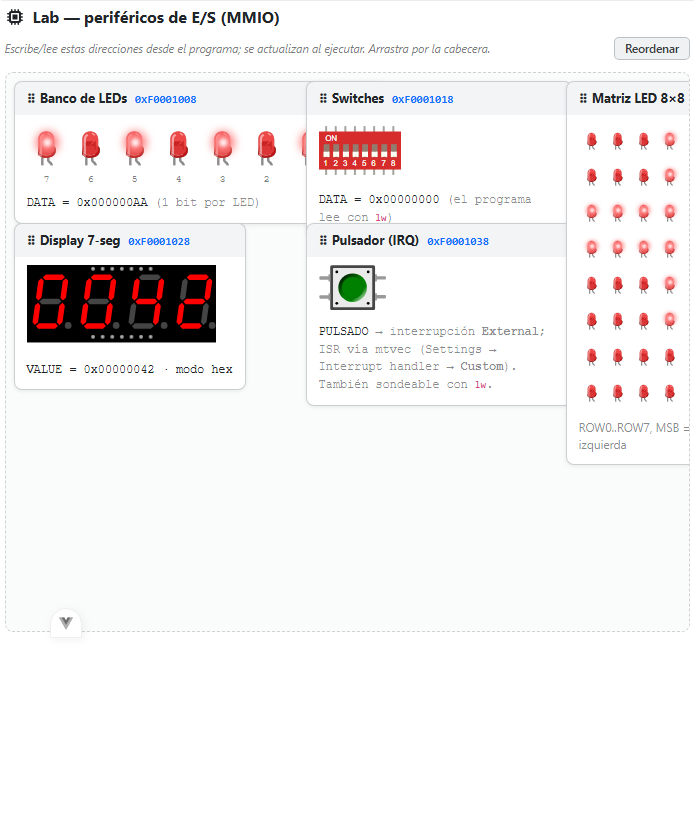
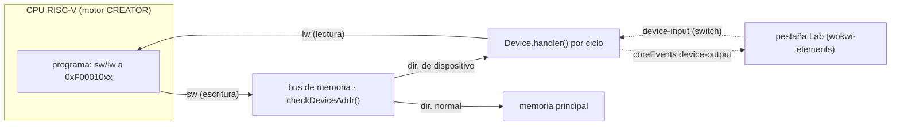

# 06 · Lab — periféricos de E/S por MMIO (modo *Lab*)

> *Captura de referencia del simulador real (este plan describe qué debe verse y por qué).*

Plan de **validación manual** del modo **Lab** de la extensión docente de CREATOR (RISC-V, proyecto PID
de la UdL). Sustituye las prácticas de **E/S del KIT** (PR3/PR4: LEDs, pulsadores, pantalla) llevándolas
a **RISC-V** con periféricos visuales conectados por **E/S mapeada en memoria (MMIO)**.

## Objetivo y destinatario

**Qué se valida.** Que un programa RISC-V controla periféricos **escribiendo y leyendo direcciones de
memoria** (MMIO): encender LEDs, leer switches, mostrar un valor en un display de 7 segmentos y dibujar
en una matriz 8×8 — y que el estado de los periféricos **se actualiza al ejecutar** (Step/Run).

**Para quién.** Profesorado de Arquitectura de Computadores de la UdL. Permite: (1) cargar el ejemplo,
(2) ejecutar, (3) ver en la pestaña **Lab** cómo cada `sw`/`lw` afecta al periférico, (4) confirmar que
el comportamiento coincide con el modelo teórico de E/S mapeada en memoria.

> **Licencias.** Los dibujos de los periféricos son los web components **[@wokwi/elements](https://github.com/wokwi/wokwi-elements)** (**MIT**, solo presentación). El **motor de
> simulación de Wokwi es propietario y NO se usa**: la simulación corre sobre el motor propio de CREATOR
> (un dispositivo MMIO por periférico, `src/core/executor/devices_udl.mts`).

## Teoría aplicada — E/S mapeada en memoria (MMIO)

> **¿Qué es MMIO?** Los registros de un dispositivo de E/S se ubican en el **mismo espacio de
> direcciones** que la memoria. La CPU se comunica con el dispositivo con las **mismas instrucciones**
> de acceso a memoria (`lw`/`sw`) — no hay instrucciones de E/S especiales (a diferencia de la E/S por
> puertos, *port-mapped*, de x86). — *P&H COD-RISCV, §6.6 (Communicating with I/O Devices); Stallings,
> cap. 7 (I/O).*

> **Registros de dispositivo.** Un periférico expone típicamente tres registros:
> - **DATA**: el dato (p. ej. el patrón de LEDs, el estado de los switches, el valor del display).
> - **CTRL** (control): órdenes/configuración (p. ej. el modo del 7-seg, habilitar).
> - **STATUS**: estado (p. ej. *ready*). En este Lab los periféricos son simples y DATA basta.

> **Sondeo (*polling*) vs interrupción.** El programa puede **sondear** (leer DATA/STATUS en bucle) o
> esperar una **interrupción**. Los ejemplos de este Lab usan *polling* (bucles que leen/escriben).
> CREATOR también soporta interrupciones (grupo *Interrupts*), base para una práctica de "pulsador → ISR".

> La dirección la **enruta** `checkDeviceAddr()`: si cae en una región de dispositivo va a la memoria del
> dispositivo (no a la RAM). El `handler()` de cada dispositivo corre **una vez por ciclo**, por eso los
> LEDs cambian al ritmo del **Step**/Run.

## Preparación

| Elemento | Valor |
|----------|-------|
| Arrancar | `npx vite` → `http://localhost:5210` |
| Arquitectura | **RISC-V (RV32IMFD)** |
| Grupo de ejemplos (botón **Examples**) | **`UdL · Test Lab (I/O)`** |
| Vista | pestaña **Lab** (solo RISC-V RV32) |
| Ejecución | **Run** (todo) o **Step** (paso a paso) |

### Mapa de registros MMIO (región `0xF0001000`)

| Periférico | DATA | CTRL | STATUS | Convención |
|------------|------|------|--------|------------|
| Banco de LEDs | `0xF0001008` | `0xF0001000` | `0xF0001004` | 1 bit por LED |
| Switches | `0xF0001018` | `0xF0001010` | `0xF0001014` | 1 bit por switch (lectura) |
| Display 7-seg | `0xF0001028` | `0xF0001020` (modo) | `0xF0001024` | valor; modo 2 = hex, 1 = dec |
| Pulsador (IRQ) | `0xF0001038` | `0xF0001030` | `0xF0001034` | bit0 = pulsado; flanco de subida → interrupción **External** |
| Matriz LED 8×8 | `0xF0001048` (ROW0, +4/fila) | `0xF0001040` | `0xF0001044` | bitmap por fila, **MSB = columna izquierda** |

> **Lienzo arrastrable.** Los periféricos se pueden **arrastrar por su cabecera** (manija `⠿`) y la
> disposición se guarda (localStorage); el botón **Reordenar** restaura la posición por defecto.

> Está separada de la consola/SO (`0xF0000000`–`0xF000001F`), que CREATOR ya tenía.

## Pasos de validación

| Paso | Acción | Dónde mirar (Lab) | Valor esperado | Justificación teórica |
|:----:|--------|-------------------|----------------|------------------------|
| 1 | Cargar `Lab 01 · Encender LEDs`; **Run**; abrir **Lab** | Banco de LEDs | `DATA = 0x000000AA`; LEDs **7,5,3,1** encendidos, **6,4,2,0** apagados | `sw` de `0xAA` (`1010 1010`) al registro DATA: cada bit a 1 enciende su LED (MMIO de salida). |
| 2 | Cargar `Lab 02 · Contador en LEDs`; **Step** repetidamente | Banco de LEDs | el patrón cuenta `0,1,2,…,15` en binario | Cada iteración escribe el contador en DATA; el `handler()` por ciclo actualiza el LED → cambio **al ritmo de la ejecución**. |
| 3 | Cargar `Lab 03 · Leer switches`; abrir **Lab**; **conmutar** un switch; **Step** | Switches → LEDs | el LED del bit conmutado se enciende | `lw` de DATA de switches: la **entrada** (UI → registro) la lee el programa con la misma instrucción de memoria. |
| 4 | Cargar `Lab 04 · Matriz LED 8x8`; **Run**; **Lab** | Matriz 8×8 | un **rombo** encendido | 8 `sw` a ROW0..ROW7; cada palabra es el bitmap de una fila (MSB = columna izquierda). |
| 5 | Cargar `Lab 05 · Display 7-seg`; **Run**; **Lab** | Display 7-seg | muestra **`CAFE`** (modo hex) | `sw` de modo=2 a CTRL + `sw` de `0xCAFE` a VALUE; el display decodifica cada nibble a 7 segmentos. |
| 6 | Cargar `Lab · completo`; **Run**; **Lab** | todos | LEDs `0xAA` + 7-seg `0042` + matriz flecha | Un solo programa controla los periféricos por MMIO. |
| 7 | Cargar `Lab 07 · Pulsador (sondeo)`; **Lab**; **Step** y **mantén pulsado** el botón | Pulsador + LED 0 | el botón marca **PULSADO**; el LED 0 se enciende mientras lo mantienes | **Sondeo (polling)**: la CPU lee el registro del botón en bucle (`lw`) y refleja el bit. |
| 8 | **Settings → Interrupt handler → Custom (architecture)**; cargar `Lab 06 · Pulsador (interrupción)`; **Step** por el bucle de espera y **pulsa** el botón | LEDs (contador) | al pulsar, la **ISR** (mtvec) salta e **incrementa** el contador de LEDs; vuelve con `mret` | **Interrupción External**: el flanco de subida marca `mip` (bit 11); con `mstatus.MIE` + `mie.MEIE` el núcleo vectoriza a la ISR. Contraste sondeo↔interrupción (tema clásico de AC). |

## Variaciones

- **Cambiar el patrón**: edita el inmediato del `sw` (p. ej. `0xFF` → todos los LEDs; `0x01` → solo el LED 0) y re-ejecuta.
- **Entrada viva**: con `Lab 03` cargado, ve haciendo **Step** mientras conmutas switches → comprueba que el programa lee el valor vigente en cada `lw` (modelo de entrada por sondeo).
- **Display decimal**: escribe `1` (en vez de `2`) en el registro de modo del 7-seg → el mismo VALUE se muestra en decimal.
- **Matriz**: diseña tu propio bitmap de 8 filas (una letra, un icono) y verifica que MSB = columna izquierda.

## Checklist de validación

- [ ] Lab 01 — `0xAA` enciende los LEDs 7,5,3,1 y DATA muestra `0x000000AA`. *(¿coincide con teoría? Sí/No — nota)*
- [ ] Lab 02 — el contador avanza en binario en los LEDs con cada Step. *(Sí/No)*
- [ ] Lab 03 — conmutar un switch + Step enciende el LED correspondiente (entrada por MMIO). *(Sí/No)*
- [ ] Lab 04 — la matriz muestra el rombo (MSB = columna izquierda). *(Sí/No)*
- [ ] Lab 05 — el 7-seg muestra `CAFE` en hex. *(Sí/No)*
- [ ] Lab completo — los periféricos reflejan el programa a la vez. *(Sí/No)*
- [ ] Lab 07 — mantener pulsado el botón enciende el LED 0 (sondeo). *(Sí/No)*
- [ ] Lab 06 — con handler **Custom**, pulsar dispara la ISR y suma 1 a los LEDs (interrupción). *(Sí/No)*
- [ ] El lienzo permite **arrastrar** periféricos por la cabecera y **Reordenar** los recoloca. *(Sí/No)*
- [ ] Las direcciones MMIO de la tabla coinciden con las que muestra la vista. *(Sí/No)*

## Referencias

- D. A. Patterson, J. L. Hennessy. *Computer Organization and Design: The Hardware/Software Interface,
  RISC-V Edition*. **§6.6** (Communicating with I/O Devices — memory-mapped I/O, polling, interrupciones).
- W. Stallings. *Computer Organization and Architecture*. Cap. 7 (Input/Output).
- Implementación: `src/core/executor/devices_udl.mts` (dispositivos MMIO), `src/web/components/simulator/LabView.vue`
  (vista), sobre el marco `Device` existente (`src/core/executor/devices.mts`).
- Visuales: [@wokwi/elements](https://github.com/wokwi/wokwi-elements) (MIT).

---

This work has been granted by the Ministerio de Ciencia, Innovación y Universidades (MICIU)
AEI/10.13039/501100011033 under contract PID2023-146193OB-I00.
